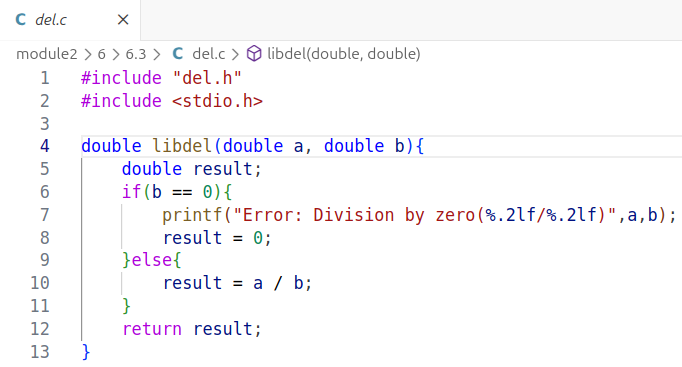
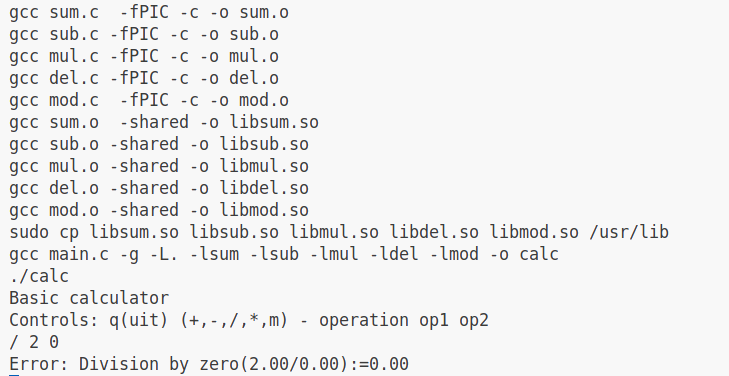
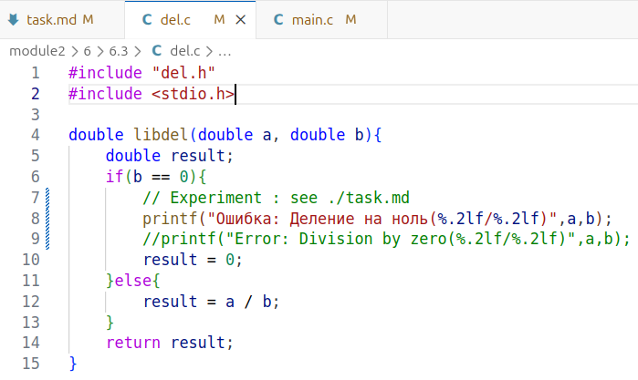
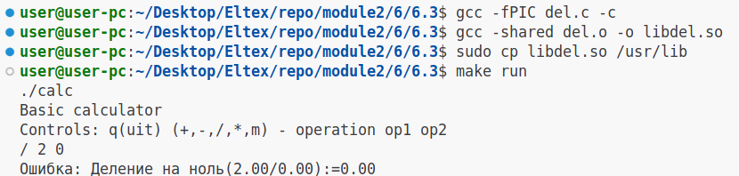

6.3 (3 балла). Доработать решение задачи 2.3 (калькулятор) так, чтобы
функции загружались из динамических библиотек. В одной библиотеке
находится одна функция. При запуске программы считывается каталог с
библиотеками и загружаются найденные функции.

Эксперимент

Изменения будем производить в файле исходного кода del.c(соответственно в библиотеке libdel.so): 

Исходный файл:

Процесс первичной компиляции + запуск исходной программы:

Изменения в del.c

Повторный запуск

Рекомпиляция объектного файла и бибилотеки:

Запуск исходного исполняемого файла:

