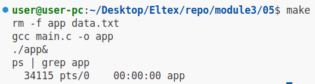
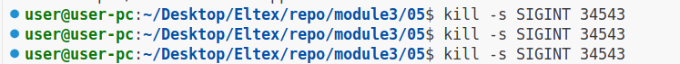
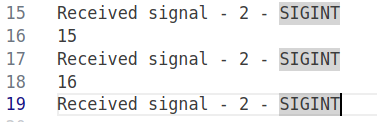
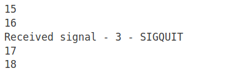
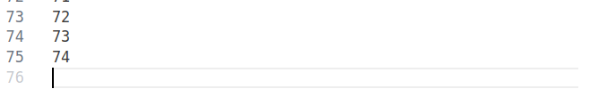

| Сигнал    | Ожидание | Результат |
| --------- | -------- | --------- |
| SIGINT    | Вывод обработки в файле(после 3-его завершение программы) | Успех |
| SIGQUIT   | Вывод обработки в файле| Успех |
| SIGABRT   | - | Успех( signal() настроен на игнорирование сигнала)    |
| SIGKILL   | Завершение программы | Успех|
| SIGTSTP   | - | Успех( signal() настроен на игнорирование сигнала)    |
| SIGSTOP   | - | Успех( signal() настроен на игнорирование сигнала)    |
| SIGCONT   | - | Успех( signal() настроен на игнорирование сигнала)    |

### SIGINT:

Первичная компиляция, запуск в фоне:

Обработка сигнала SIGINT:

Выход из программы:

### SIGQUIT:

Обработка сигнала SIGQUIT:

### SIGKILL:

Обработка сигнала SIGKILL:

