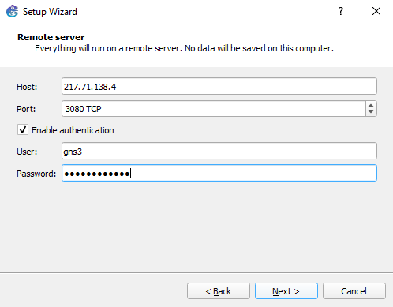

## Лабораторная работа №1 *"Освоение инструментария для выполнения работ, построение простой сети"*

### 1) Установить и настроить эмулятор GNS3:

Открываем вкладку Setup Wizard:


Выбираем опцию *remote server*:


Вводим данные удалённого сервера(хост,порт логин,пароль для аутентификации):



Проверка введённых данных:


### 2) Создать простейшую сеть, состоящую из 1 коммутатора и 2 компьютеров, назначить им произвольные ip адреса из одной сети

Для построения топологии сети поочередно перетаскиваем из левого окошка устройства(Коммутатор(Layer2 Switch), Компьютер(VPCS)):


Для соединения элементов выбрать инструмент Add a Link, затем поочередно от Ethernet первого компьютера провести сооединения до коммутатора, данную операцию повторить для второго компьютера:


Итоговая топология сети:


Для назначения произвольных ip-адресов необходимо изменить файл конфигурации startup.vpc:


### 3) Запустить симуляцию, выполнить команду ping с одного из компьютеров, используя ip адрес второго компьютера

Запуск симуляции:


Выполнение команды ping:

Пинг происходит с *PC1* на *PC2*

#### Текст:

Ввод:

``` 
ping 192.168.1.2  
```

Вывод:

``` 
84 bytes from 192.168.1.2 icmp_seq=1 ttl=64 time=15.649 ms
84 bytes from 192.168.1.2 icmp_seq=2 ttl=64 time=0.680 ms
84 bytes from 192.168.1.2 icmp_seq=3 ttl=64 time=6.234 ms
84 bytes from 192.168.1.2 icmp_seq=4 ttl=64 time=0.549 ms
84 bytes from 192.168.1.2 icmp_seq=5 ttl=64 time=5.338 ms

```

#### Скриншот:


### 4) Перехватить трафик протокола arp на всех линках(nb!), задокументировать и проанализировать заголовки пакетов в программе Wireshark, для фильтрации трафика, относящегося к указанному протоколу использовать фильтры Wireshark

#### Захват на линке 1(PC1 Ethernet 0 to Switch Ethernet 0):


##### Заголовки пакета:


##### Анализ ARP-запроса

**Источник**: Wireshark (Frame 95)  
**Протокол**: ARP (Address Resolution Protocol)  

##### Общая информация
- **Тип пакета**: ARP-запрос (`request`)  
- **Назначение**: Определение MAC-адреса устройства с известным IP-адресом.  
- **Широковещательная рассылка**: Да (MAC назначения: `ff:ff:ff:ff:ff:ff`).  

##### Заголовок ARP
| Поле               | Значение                          | Описание                          |
|---------------------|-----------------------------------|-----------------------------------|
| **Hardware type**    | Ethernet (1)                      | Тип сети (Ethernet).              |
| **Protocol type**    | IPv4 (`0x0800`)                   | Используемый протокол (IPv4).     |
| **Hardware size**    | 6                                 | Длина MAC-адреса (6 байт).        |
| **Protocol size**    | 4                                 | Длина IP-адреса (4 байта).        |
| **Opcode**          | `request` (1)                     | Тип операции (запрос).            |

##### Адреса
##### Отправитель (Sender)
- **MAC-адрес**: `00:50:79:66:68:01` (Private_66:68:01)  
- **IP-адрес**: `192.168.1.1`  

##### Получатель (Target)
- **MAC-адрес**: `ff:ff:ff:ff:ff:ff` (Broadcast)  
- **IP-адрес**: `192.168.1.2`  

##### Вывод
Устройство `192.168.1.1` ищет MAC-адрес устройства `192.168.1.2`, рассылая ARP-запрос всем узлам сети (`Broadcast`). Ожидается, что устройство с IP `192.168.1.2` ответит, указав свой MAC-адрес.

##### Захват на линке 2(Switch Ethernet 1 to PC2 Ethernet 0 ):


##### Заголовки пакета:


# Анализ ARP-ответа (Frame 48)

**Источник**: Wireshark (Frame 48)  
**Протокол**: ARP (Address Resolution Protocol)  

## Общая информация
- **Тип пакета**: ARP-ответ (`reply`)  
- **Назначение**: Сообщение MAC-адреса в ответ на ARP-запрос  
- **Широковещательная рассылка**: Нет (направленный ответ)  

## Детали заголовка ARP
| Поле                | Значение                          | Описание                          |
|----------------------|-----------------------------------|-----------------------------------|
| **Hardware type**    | Ethernet (1)                      | Среда передачи - Ethernet         |
| **Protocol type**    | IPv4 (0x0800)                     | Протокол верхнего уровня - IPv4   |
| **Hardware size**    | 6                                 | Длина MAC-адреса (6 байт)         |
| **Protocol size**    | 4                                 | Длина IP-адреса (4 байта)         |
| **Opcode**           | `reply` (2)                       | Тип операции - ответ              |

## Адресация
### Отправитель (Sender)
- **MAC-адрес**: `00:50:79:66:68:00` (Private_66:68:00)  
- **IP-адрес**: `192.168.1.2`  

### Получатель (Target)
- **MAC-адрес**: `00:50:79:66:68:01` (Private_66:68:01)  
- **IP-адрес**: `192.168.1.1`  

## Выводы
1. Устройство с IP `192.168.1.2` отвечает на ARP-запрос, сообщая свой MAC-адрес `00:50:79:66:68:00`.
2. Ответ направлен конкретному устройству (`00:50:79:66:68:01`), а не широковещательно.
3. **Контекст**:
   - Это ответ на ARP-запрос из Frame 47 (где `192.168.1.1` искал MAC для `192.168.1.2`).
   - В ARP-ответе поля Sender и Target меняются местами по сравнению с запросом.

## Сравнение с ARP-запросом (Frame 95)
| Характеристика      | ARP-запрос (Frame 95)          | ARP-ответ (Frame 48)            |
|---------------------|--------------------------------|---------------------------------|
| **Opcode**          | `request` (1)                  | `reply` (2)                     |
| **Направление**     | Широковещательный             | Направленный                    |
| **Target MAC**      | `ff:ff:ff:ff:ff:ff`            | Конкретный MAC запросившего     |
| **Цель**           | Запрос MAC-адреса             | Передача MAC-адреса             |

 
### 5) Создать простейшую сеть, состоящую из 1 маршрутизатора и 2 компьютеров, назначить им произвольные ip адреса из разных сетей

Построение топологии происходит аналогично пункту 2, используются устройства(VPCS(Компьютер) и R(Маршрутизатор)):


Настройка ip-адресов gateway и маски подсети происходит в файле конфигурации маршрутизатора *startup.cfg*:


В файле конфигурации *startup.vpc* VPCS настраивается self-ip и gw-ip:


### 6) Запустить симуляцию, выполнить команду ping с одного из компьютеров, используя ip адрес второго компьютера

Запуск симуляции:


Выполнение команды ping:

Пинг происходит с *PC3* на *PC4*

#### Текст:

Ввод:

``` 
ping 192.168.1.1
```

Вывод:

``` 
192.168.1.1 icmp_seq=1 timeout
84 bytes from 192.168.1.1 icmp_seq=2 ttl=63 time=11.814 ms
84 bytes from 192.168.1.1 icmp_seq=3 ttl=63 time=15.291 ms
84 bytes from 192.168.1.1 icmp_seq=4 ttl=63 time=16.195 ms
84 bytes from 192.168.1.1 icmp_seq=5 ttl=63 time=15.428 ms
```

#### Скриншот:


### 7) Перехватить трафик протокола arp и icmp на всех линках(nb!), задокументировать и проанализировать заголовки пакетов в программе Wireshark, для фильтрации трафика, относящегося к указанному протоколу использовать фильтры Wireshark

#### Захват на линке 1(PC3 Ethernet 0 to Router Fast Ethernet 0/0):


#### Заголовки

ARP-request:


ARP-response:


ICMP: Echo(ping) request:


ICMP: Echo(ping) reply:


#### Анализ заголовков (Frames 5-8)

## 1. ARP-запрос (Frame 5)
- **Тип**: ARP Request (запрос MAC-адреса)
- **Отправитель**: 
  - MAC: `cc:01:1e:69:00:00` 
  - IP: `192.168.2.5`
- **Цель**: 
  - Искомый IP: `192.168.2.1` (роутер?) 
  - Target MAC: `00:00:00:00:00:00` (неизвестен)
- **Особенности**: Широковещательный запрос (`ff:ff:ff:ff:ff:ff`)

## 2. ARP-ответ (Frame 6)
- **Тип**: ARP Reply (ответ с MAC-адресом)
- **Отправитель**: 
  - MAC: `00:50:79:66:68:03` 
  - IP: `192.168.2.1` (подтверждает, что это роутер)
- **Цель**: 
  - MAC: `cc:01:1e:69:00:00` (отправитель запроса)
  - IP: `192.168.2.5`

## 3. ICMP-запрос (Frame 7)
- **Тип**: Ping Request (проверка доступности)
- **Отправитель**: 
  - MAC: `00:50:79:66:68:03` (роутер)
  - IP: `192.168.2.1`
- **Получатель**: 
  - MAC: `cc:01:1e:69:00:00`
  - IP: `192.168.1.1` (устройство в другой подсети)
- **Данные**: 56 байт (стандартный размер ping)

## 4. ICMP-ответ (Frame 8)
- **Тип**: Ping Reply (ответ на ping)
- **Отправитель**: 
  - MAC: `cc:01:1e:69:00:00`
  - IP: `192.168.1.1`
- **Получатель**: 
  - MAC: `00:50:79:66:68:03`
  - IP: `192.168.2.1`
- **Время ответа**: 17.862 мс
- **Данные**: 56 байт (совпадают с запросом)

## Выводы
1. **ARP-процесс**:
   - Устройство `192.168.2.5` нашло MAC роутера (`192.168.2.1`).
   
2. **Межсетевой ping**:
   - Роутер (`192.168.2.1`) пингует устройство в другой подсети (`192.168.1.1`).
   - Успешный ответ подтверждает работоспособность сети.

3. **Особенности**:
   - Использование ARP перед ICMP - стандартный процесс.
   - Время ответа 17.8 мс указывает на небольшую задержку.

#### Захват на линке 2(Router Fast Ethernet 0/1 to PC4 Ethernet 0):


ARP-request:


ARP-response:


ICMP: Echo(ping) request:


ICMP: Echo(ping) reply:


#### Анализ заголовков (Frames 4-8)

## 1. ARP-запрос (Frame 4)
- **Тип**: ARP Request (широковещательный запрос MAC)
- **Отправитель**:
  - MAC: `00:50:79:66:68:02` (Private_66:68:02)
  - IP: `192.168.1.1`
- **Цель**:
  - Запрашиваемый IP: `192.168.1.5`
  - Target MAC: `ff:ff:ff:ff:ff:ff` (широковещательный)

## 2. ARP-ответ (Frame 5)
- **Тип**: ARP Reply (ответ с MAC)
- **Отправитель**:
  - MAC: `cc:01:1e:69:00:10`
  - IP: `192.168.1.5` (целевое устройство)
- **Получатель**:
  - MAC: `00:50:79:66:68:02`
  - IP: `192.168.1.1`

## 3. ICMP-запрос (Frame 7)
- **Тип**: Ping Request (Type 8)
- **Отправитель**:
  - MAC: `cc:01:1e:69:00:10`
  - IP: `192.168.2.1` (из другой подсети)
- **Получатель**:
  - MAC: `00:50:79:66:68:02`
  - IP: `192.168.1.1`
- **Детали**:
  - ID: 58024, Seq: 2
  - Данные: 56 байт

## 4. ICMP-ответ (Frame 8)
- **Тип**: Ping Reply (Type 0)
- **Отправитель**:
  - MAC: `00:50:79:66:68:02`
  - IP: `192.168.1.1`
- **Получатель**:
  - MAC: `cc:01:1e:69:00:10`
  - IP: `192.168.2.1`
- **Характеристики**:
  - Время ответа: 0.077 мс (очень быстро)
  - Те же ID/Seq, что и в запросе

## Выводы
1. **Последовательность работы**:
   - Сначала ARP-разрешение адресов (Frames 4-5)
   - Затем межсетевой ping (Frames 7-8)

2. **Особенности**:
   - Устройство `192.168.1.1` взаимодействует с `192.168.2.1` через роутер
   - Низкая задержка (0.077 мс)
