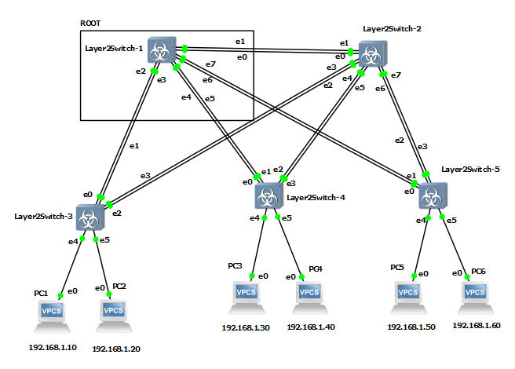

## Лабораторная работа №2 "Настройка протокола STP (IEEE 802.1D)"

Исходная топология:



### 1) Для заданной на схеме schema-lab2 сети, состоящей из управляемых коммутаторов и персональных компьютеров настроить протокол STP, назначив явно один из коммутаторов корневым настройкой приоритета.

Если корневой коммутатор (root) не указан явно (при равном значении priority=32769), в качестве корневого автоматически используется устройство с меньшим MAC адресом.

Явно настроим корневой узел (root) на устройстве Layer2Switch-1:


Далее команды для настройки:

Текстовый формат:

```
enable
```
Выполняем данную команду для перехода в цепочке режимов Cisco IOS User-Exec -> Privilige -> Configuration

Ввод:

```
conf terminal
```

Вывод:

```
Enter configuration commands, one per line.  End with CNTL/Z.
```
Скриншоты:


Ввод:

```
spanning-tree vlan 100 root primary
exit
show spanning-tree
write
```

Вывод:

```
*Aug 13 07:31:30.616: %SYS-5-CONFIG_I: Configured from console by console

VLAN0001
  Spanning tree enabled protocol ieee
  Root ID    Priority    20481
             Address     0ce3.77ae.0000
             This bridge is the root
             Hello Time   2 sec  Max Age 20 sec  Forward Delay 15 sec

  Bridge ID  Priority    20481  (priority 20480 sys-id-ext 1)
             Address     0ce3.77ae.0000
             Hello Time   2 sec  Max Age 20 sec  Forward Delay 15 sec
             Aging Time  300 sec

Interface           Role Sts Cost      Prio.Nbr Type
------------------- ---- --- --------- -------- --------------------------------
Gi0/0               Desg FWD 4         128.1    Shr
Gi0/1               Desg FWD 4         128.2    Shr
Gi0/2               Desg FWD 4         128.3    Shr
Gi0/3               Desg FWD 4         128.4    Shr
Gi1/0               Desg FWD 4         128.5    Shr
Gi1/1               Desg FWD 4         128.6    Shr
Gi1/2               Desg FWD 4         128.7    Shr
Gi1/3               Desg FWD 4         128.8    Shr
Gi2/0               Desg FWD 4         128.9    Shr

Building configuration...
Compressed configuration from 5316 bytes to 2052 bytes[OK]
vIOS-L2-01#
*Aug 13 07:33:40.923: %GRUB-5-CONFIG_WRITING: GRUB configuration is being updated on disk. Please wait...
*Aug 13 07:33:41.681: %GRUB-5-CONFIG_WRITTEN: GRUB configuration was written to disk successfully.

```

### 2) Проверить доступность каждого с каждым всех персональных компьютеров (VPCS), результаты запротоколировать.

Проверим доступность используя ping:

#### PC1 (192.168.1.10)

Ping PC1(192.168.1.10) -> PC2(192.168.1.20):

```
ping 192.168.1.20
```

```
84 bytes from 192.168.1.20 icmp_seq=1 ttl=64 time=9.924 ms
84 bytes from 192.168.1.20 icmp_seq=2 ttl=64 time=0.769 ms
84 bytes from 192.168.1.20 icmp_seq=3 ttl=64 time=2.879 ms
84 bytes from 192.168.1.20 icmp_seq=4 ttl=64 time=3.373 ms
84 bytes from 192.168.1.20 icmp_seq=5 ttl=64 time=0.847 ms
```

Ping PC1(192.168.1.10) -> PC3(192.168.1.30):

```
ping 192.168.1.30
```

```
84 bytes from 192.168.1.30 icmp_seq=1 ttl=64 time=7.928 ms
84 bytes from 192.168.1.30 icmp_seq=2 ttl=64 time=8.704 ms
84 bytes from 192.168.1.30 icmp_seq=3 ttl=64 time=3.506 ms
84 bytes from 192.168.1.30 icmp_seq=4 ttl=64 time=8.140 ms
84 bytes from 192.168.1.30 icmp_seq=5 ttl=64 time=8.308 ms
```

Ping PC1(192.168.1.10) -> PC4(192.168.1.40):

```
ping 192.168.1.40
```

```
84 bytes from 192.168.1.40 icmp_seq=1 ttl=64 time=3.539 ms
84 bytes from 192.168.1.40 icmp_seq=2 ttl=64 time=11.081 ms
84 bytes from 192.168.1.40 icmp_seq=3 ttl=64 time=6.205 ms
84 bytes from 192.168.1.40 icmp_seq=4 ttl=64 time=3.987 ms
84 bytes from 192.168.1.40 icmp_seq=5 ttl=64 time=4.097 ms
```

Ping PC1(192.168.1.10) -> PC5(192.168.1.50):

```
ping 192.168.1.50
```

```
84 bytes from 192.168.1.50 icmp_seq=1 ttl=64 time=5.176 ms
84 bytes from 192.168.1.50 icmp_seq=2 ttl=64 time=8.801 ms
84 bytes from 192.168.1.50 icmp_seq=3 ttl=64 time=4.248 ms
84 bytes from 192.168.1.50 icmp_seq=4 ttl=64 time=10.518 ms
84 bytes from 192.168.1.50 icmp_seq=5 ttl=64 time=2.400 ms
```

Ping PC1(192.168.1.10) -> PC6(192.168.1.60):

```
ping 192.168.1.60
```

```
84 bytes from 192.168.1.60 icmp_seq=1 ttl=64 time=15.458 ms
84 bytes from 192.168.1.60 icmp_seq=2 ttl=64 time=7.141 ms
84 bytes from 192.168.1.60 icmp_seq=3 ttl=64 time=5.728 ms
84 bytes from 192.168.1.60 icmp_seq=4 ttl=64 time=8.944 ms
84 bytes from 192.168.1.60 icmp_seq=5 ttl=64 time=7.057 ms
```

#### PC2 (192.168.1.20)

Ping PC2(192.168.1.20) -> PC1(192.168.1.10):

```
ping 192.168.1.10
```

```
84 bytes from 192.168.1.10 icmp_seq=1 ttl=64 time=0.581 ms
84 bytes from 192.168.1.10 icmp_seq=2 ttl=64 time=0.679 ms
84 bytes from 192.168.1.10 icmp_seq=3 ttl=64 time=0.782 ms
84 bytes from 192.168.1.10 icmp_seq=4 ttl=64 time=0.921 ms
84 bytes from 192.168.1.10 icmp_seq=5 ttl=64 time=0.505 ms
```

Ping PC2(192.168.1.20) -> PC3(192.168.1.30):

```
ping 192.168.1.30
```

```
84 bytes from 192.168.1.30 icmp_seq=1 ttl=64 time=15.859 ms
84 bytes from 192.168.1.30 icmp_seq=2 ttl=64 time=7.627 ms
84 bytes from 192.168.1.30 icmp_seq=3 ttl=64 time=8.594 ms
84 bytes from 192.168.1.30 icmp_seq=4 ttl=64 time=7.896 ms
84 bytes from 192.168.1.30 icmp_seq=5 ttl=64 time=4.859 ms
```

Ping PC2(192.168.1.20) -> PC4(192.168.1.40):

```
ping 192.168.1.40
```

```
84 bytes from 192.168.1.40 icmp_seq=1 ttl=64 time=12.270 ms
84 bytes from 192.168.1.40 icmp_seq=2 ttl=64 time=2.881 ms
84 bytes from 192.168.1.40 icmp_seq=3 ttl=64 time=7.460 ms
84 bytes from 192.168.1.40 icmp_seq=4 ttl=64 time=6.748 ms
84 bytes from 192.168.1.40 icmp_seq=5 ttl=64 time=1.795 ms
```

Ping PC2(192.168.1.20) -> PC5(192.168.1.50):

```
ping 192.168.1.50
```

```
84 bytes from 192.168.1.50 icmp_seq=1 ttl=64 time=7.006 ms
84 bytes from 192.168.1.50 icmp_seq=2 ttl=64 time=7.725 ms
84 bytes from 192.168.1.50 icmp_seq=3 ttl=64 time=7.027 ms
84 bytes from 192.168.1.50 icmp_seq=4 ttl=64 time=4.519 ms
84 bytes from 192.168.1.50 icmp_seq=5 ttl=64 time=1.792 ms
```

Ping PC2(192.168.1.20) -> PC6(192.168.1.60):

```
ping 192.168.1.60
```

```
84 bytes from 192.168.1.60 icmp_seq=1 ttl=64 time=12.256 ms
84 bytes from 192.168.1.60 icmp_seq=2 ttl=64 time=7.375 ms
84 bytes from 192.168.1.60 icmp_seq=3 ttl=64 time=6.575 ms
84 bytes from 192.168.1.60 icmp_seq=4 ttl=64 time=14.569 ms
84 bytes from 192.168.1.60 icmp_seq=5 ttl=64 time=7.590 ms
```

#### PC3 (192.168.1.30)

Ping PC3(192.168.1.30) -> PC1(192.168.1.10):

```
ping 192.168.1.10
```

```
84 bytes from 192.168.1.10 icmp_seq=1 ttl=64 time=5.447 ms
84 bytes from 192.168.1.10 icmp_seq=2 ttl=64 time=13.390 ms
84 bytes from 192.168.1.10 icmp_seq=3 ttl=64 time=7.184 ms
84 bytes from 192.168.1.10 icmp_seq=4 ttl=64 time=9.103 ms
84 bytes from 192.168.1.10 icmp_seq=5 ttl=64 time=7.395 ms
```

Ping PC3(192.168.1.30) -> PC2(192.168.1.20):

```
ping 192.168.1.20
```

```
84 bytes from 192.168.1.20 icmp_seq=1 ttl=64 time=5.813 ms
84 bytes from 192.168.1.20 icmp_seq=2 ttl=64 time=9.512 ms
84 bytes from 192.168.1.20 icmp_seq=3 ttl=64 time=5.424 ms
84 bytes from 192.168.1.20 icmp_seq=4 ttl=64 time=9.141 ms
84 bytes from 192.168.1.20 icmp_seq=5 ttl=64 time=4.805 ms
```

Ping PC3(192.168.1.30) -> PC4(192.168.1.40):

```
ping 192.168.1.40
```

```
84 bytes from 192.168.1.40 icmp_seq=1 ttl=64 time=1.676 ms
84 bytes from 192.168.1.40 icmp_seq=2 ttl=64 time=9.196 ms
84 bytes from 192.168.1.40 icmp_seq=3 ttl=64 time=7.437 ms
84 bytes from 192.168.1.40 icmp_seq=4 ttl=64 time=6.719 ms
84 bytes from 192.168.1.40 icmp_seq=5 ttl=64 time=3.081 ms
```

Ping PC3(192.168.1.30) -> PC5(192.168.1.50):

```
ping 192.168.1.50
```

```
84 bytes from 192.168.1.50 icmp_seq=1 ttl=64 time=10.329 ms
84 bytes from 192.168.1.50 icmp_seq=2 ttl=64 time=7.085 ms
84 bytes from 192.168.1.50 icmp_seq=3 ttl=64 time=7.614 ms
84 bytes from 192.168.1.50 icmp_seq=4 ttl=64 time=7.196 ms
84 bytes from 192.168.1.50 icmp_seq=5 ttl=64 time=6.957 ms
```

Ping PC3(192.168.1.30) -> PC6(192.168.1.60):

```
ping 192.168.1.60
```

```
84 bytes from 192.168.1.60 icmp_seq=1 ttl=64 time=5.804 ms
84 bytes from 192.168.1.60 icmp_seq=2 ttl=64 time=14.565 ms
84 bytes from 192.168.1.60 icmp_seq=3 ttl=64 time=13.002 ms
84 bytes from 192.168.1.60 icmp_seq=4 ttl=64 time=1.614 ms
84 bytes from 192.168.1.60 icmp_seq=5 ttl=64 time=1.420 ms
```

#### PC4 (192.168.1.40)

Ping PC4(192.168.1.40) -> PC1(192.168.1.10):

```
ping 192.168.1.10
```

```
84 bytes from 192.168.1.10 icmp_seq=1 ttl=64 time=4.872 ms
84 bytes from 192.168.1.10 icmp_seq=2 ttl=64 time=9.651 ms
84 bytes from 192.168.1.10 icmp_seq=3 ttl=64 time=3.658 ms
84 bytes from 192.168.1.10 icmp_seq=4 ttl=64 time=3.762 ms
84 bytes from 192.168.1.10 icmp_seq=5 ttl=64 time=3.459 ms
```

Ping PC4(192.168.1.40) -> PC2(192.168.1.20):

```
ping 192.168.1.20
```

```
84 bytes from 192.168.1.20 icmp_seq=1 ttl=64 time=10.169 ms
84 bytes from 192.168.1.20 icmp_seq=2 ttl=64 time=5.827 ms
84 bytes from 192.168.1.20 icmp_seq=3 ttl=64 time=9.426 ms
84 bytes from 192.168.1.20 icmp_seq=4 ttl=64 time=1.842 ms
84 bytes from 192.168.1.20 icmp_seq=5 ttl=64 time=1.874 ms
```

Ping PC4(192.168.1.40) -> PC3(192.168.1.30):

```
ping 192.168.1.30
```

```
84 bytes from 192.168.1.30 icmp_seq=1 ttl=64 time=4.162 ms
84 bytes from 192.168.1.30 icmp_seq=2 ttl=64 time=6.797 ms
84 bytes from 192.168.1.30 icmp_seq=3 ttl=64 time=6.928 ms
84 bytes from 192.168.1.30 icmp_seq=4 ttl=64 time=9.403 ms
84 bytes from 192.168.1.30 icmp_seq=5 ttl=64 time=5.576 ms
```

Ping PC4(192.168.1.40) -> PC5(192.168.1.50):

```
ping 192.168.1.50
```

```
84 bytes from 192.168.1.50 icmp_seq=1 ttl=64 time=6.388 ms
84 bytes from 192.168.1.50 icmp_seq=2 ttl=64 time=1.313 ms
84 bytes from 192.168.1.50 icmp_seq=3 ttl=64 time=12.503 ms
84 bytes from 192.168.1.50 icmp_seq=4 ttl=64 time=6.246 ms
84 bytes from 192.168.1.50 icmp_seq=5 ttl=64 time=1.680 ms
```

Ping PC4(192.168.1.40) -> PC6(192.168.1.60):

```
ping 192.168.1.60
```

```
84 bytes from 192.168.1.60 icmp_seq=1 ttl=64 time=3.811 ms
84 bytes from 192.168.1.60 icmp_seq=2 ttl=64 time=7.084 ms
84 bytes from 192.168.1.60 icmp_seq=3 ttl=64 time=9.532 ms
84 bytes from 192.168.1.60 icmp_seq=4 ttl=64 time=7.926 ms
84 bytes from 192.168.1.60 icmp_seq=5 ttl=64 time=4.363 ms
```

#### PC5 (192.168.1.50)

Ping PC5(192.168.1.50) -> PC1(192.168.1.10):

```
ping 192.168.1.10
```

```
84 bytes from 192.168.1.10 icmp_seq=1 ttl=64 time=4.612 ms
84 bytes from 192.168.1.10 icmp_seq=2 ttl=64 time=3.175 ms
84 bytes from 192.168.1.10 icmp_seq=3 ttl=64 time=3.013 ms
84 bytes from 192.168.1.10 icmp_seq=4 ttl=64 time=1.738 ms
84 bytes from 192.168.1.10 icmp_seq=5 ttl=64 time=1.693 ms
```

Ping PC5(192.168.1.50) -> PC2(192.168.1.20):

```
ping 192.168.1.20
```

```
84 bytes from 192.168.1.20 icmp_seq=1 ttl=64 time=8.464 ms
84 bytes from 192.168.1.20 icmp_seq=2 ttl=64 time=3.517 ms
84 bytes from 192.168.1.20 icmp_seq=3 ttl=64 time=7.135 ms
84 bytes from 192.168.1.20 icmp_seq=4 ttl=64 time=1.816 ms
84 bytes from 192.168.1.20 icmp_seq=5 ttl=64 time=8.922 ms
```

Ping PC5(192.168.1.50) -> PC3(192.168.1.30):

```
ping 192.168.1.30
```

```
84 bytes from 192.168.1.30 icmp_seq=1 ttl=64 time=7.671 ms
84 bytes from 192.168.1.30 icmp_seq=2 ttl=64 time=6.933 ms
84 bytes from 192.168.1.30 icmp_seq=3 ttl=64 time=7.285 ms
84 bytes from 192.168.1.30 icmp_seq=4 ttl=64 time=7.621 ms
84 bytes from 192.168.1.30 icmp_seq=5 ttl=64 time=1.762 ms
```

Ping PC5(192.168.1.50) -> PC4(192.168.1.40):

```
ping 192.168.1.40
```

```
84 bytes from 192.168.1.40 icmp_seq=1 ttl=64 time=12.928 ms
84 bytes from 192.168.1.40 icmp_seq=2 ttl=64 time=9.456 ms
84 bytes from 192.168.1.40 icmp_seq=3 ttl=64 time=8.063 ms
84 bytes from 192.168.1.40 icmp_seq=4 ttl=64 time=14.109 ms
84 bytes from 192.168.1.40 icmp_seq=5 ttl=64 time=5.801 ms
```

Ping PC5(192.168.1.50) -> PC6(192.168.1.60):

```
ping 192.168.1.60
```

```
84 bytes from 192.168.1.40 icmp_seq=1 ttl=64 time=11.696 ms
84 bytes from 192.168.1.40 icmp_seq=2 ttl=64 time=7.969 ms
84 bytes from 192.168.1.40 icmp_seq=3 ttl=64 time=7.096 ms
84 bytes from 192.168.1.40 icmp_seq=4 ttl=64 time=6.479 ms
84 bytes from 192.168.1.40 icmp_seq=5 ttl=64 time=8.028 ms
```

#### PC6 (192.168.1.60)

Ping PC6(192.168.1.60) -> PC1(192.168.1.10):

```
ping 192.168.1.10
```

```
84 bytes from 192.168.1.10 icmp_seq=1 ttl=64 time=10.367 ms
84 bytes from 192.168.1.10 icmp_seq=2 ttl=64 time=3.968 ms
84 bytes from 192.168.1.10 icmp_seq=3 ttl=64 time=3.689 ms
84 bytes from 192.168.1.10 icmp_seq=4 ttl=64 time=3.110 ms
84 bytes from 192.168.1.10 icmp_seq=5 ttl=64 time=7.313 ms
```

Ping PC6(192.168.1.60) -> PC2(192.168.1.20):

```
ping 192.168.1.20
```

```
84 bytes from 192.168.1.20 icmp_seq=1 ttl=64 time=6.764 ms
84 bytes from 192.168.1.20 icmp_seq=2 ttl=64 time=7.827 ms
84 bytes from 192.168.1.20 icmp_seq=3 ttl=64 time=6.913 ms
84 bytes from 192.168.1.20 icmp_seq=4 ttl=64 time=7.232 ms
84 bytes from 192.168.1.20 icmp_seq=5 ttl=64 time=7.660 ms
```

Ping PC6(192.168.1.60) -> PC3(192.168.1.30):

```
ping 192.168.1.30
```

```
84 bytes from 192.168.1.30 icmp_seq=1 ttl=64 time=6.641 ms
84 bytes from 192.168.1.30 icmp_seq=2 ttl=64 time=8.000 ms
84 bytes from 192.168.1.30 icmp_seq=3 ttl=64 time=14.609 ms
84 bytes from 192.168.1.30 icmp_seq=4 ttl=64 time=7.769 ms
84 bytes from 192.168.1.30 icmp_seq=5 ttl=64 time=17.486 ms
```

Ping PC6(192.168.1.60) -> PC4(192.168.1.40):

```
ping 192.168.1.40
```

```
84 bytes from 192.168.1.40 icmp_seq=1 ttl=64 time=24.000 ms
84 bytes from 192.168.1.40 icmp_seq=2 ttl=64 time=14.493 ms
84 bytes from 192.168.1.40 icmp_seq=3 ttl=64 time=8.250 ms
84 bytes from 192.168.1.40 icmp_seq=4 ttl=64 time=7.499 ms
84 bytes from 192.168.1.40 icmp_seq=5 ttl=64 time=6.669 ms
```

Ping PC6(192.168.1.60) -> PC5(192.168.1.50):

```
ping 192.168.1.50
```

```
84 bytes from 192.168.1.50 icmp_seq=1 ttl=64 time=6.614 ms
84 bytes from 192.168.1.50 icmp_seq=2 ttl=64 time=7.066 ms
84 bytes from 192.168.1.50 icmp_seq=3 ttl=64 time=5.484 ms
84 bytes from 192.168.1.50 icmp_seq=4 ttl=64 time=0.520 ms
84 bytes from 192.168.1.50 icmp_seq=5 ttl=64 time=7.653 ms
```

### 3) На изображении схемы отметить BID каждого коммутатора и режимы работы портов (RP/DP/blocked) и стоимости маршрутов, результат сохранить в файл


### 4) При помощи wireshark отследить передачу пакетов hello от корневого коммутатора на всех линках (nb!), результаты включить в отчет.

#### Layer2Switch-1 Links:

Capture on link : Layer2Switch-1 port Ethernet2 to Layer2Switch-3 port Ethernet0 : 


Capture on link : Layer2Switch-1 port Ethernet3 to Layer2Switch-3 port Ethernet1 :


Capture on link : Layer2Switch-1 port Ethernet4 to Layer2Switch-4 port Ethernet0 :


Capture on link : Layer2Switch-1 port Ethernet5 to Layer2Switch-4 port Ethernet1 :


Capture on link : Layer2Switch-1 port Ethernet6 to Layer2Switch-5 port Ethernet0 :


Capture on link : Layer2Switch-1 port Ethernet7 to Layer2Switch-5 port Ethernet1 :


Capture on link : Layer2Switch-1 port Ethernet0 to Layer2Switch-2 port Ethernet0 :


Capture on link : Layer2Switch-1 port Ethernet1 to Layer2Switch-2 port Ethernet1 :


#### Layer2Switch-2 Links:

Capture on link : Layer2Switch-3 port Ethernet3 to Layer2Switch-2 port Ethernet3 :

Capture on link : Layer2Switch-3 port Ethernet2 to Layer2Switch-2 port Ethernet2 :

Capture on link : Layer2Switch-3 port Ethernet3 to Layer2Switch-2 port Ethernet3 :

Capture on link : Layer2Switch-3 port Ethernet2 to Layer2Switch-2 port Ethernet2 :

#### Layer2Switch-3 Links:

Capture on link : Layer2Switch-3 port Ethernet3 to Layer2Switch-2 port Ethernet3 :

Capture on link : Layer2Switch-3 port Ethernet2 to Layer2Switch-2 port Ethernet2 :

### 5) Изменить стоимость маршрута для порта RP произвольного назначенного (designated) коммутатора, повторить действия из п.3, результат сохранить в отдельный файл.


### 6) Сохранить файлы конфигураций устройств в виде набора файлов с именами, соответствующими именам устройств.