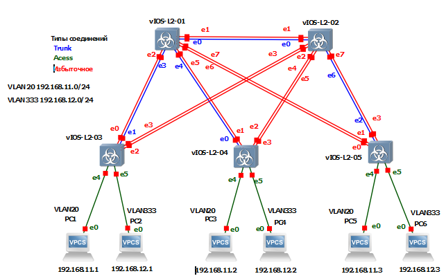
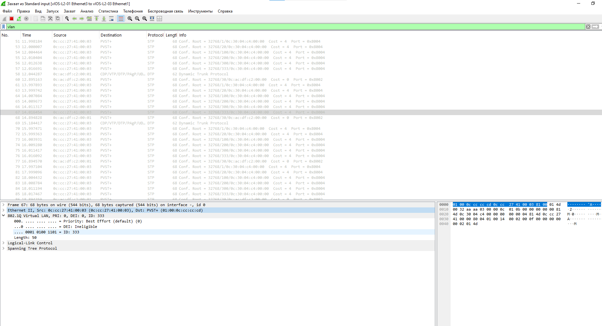
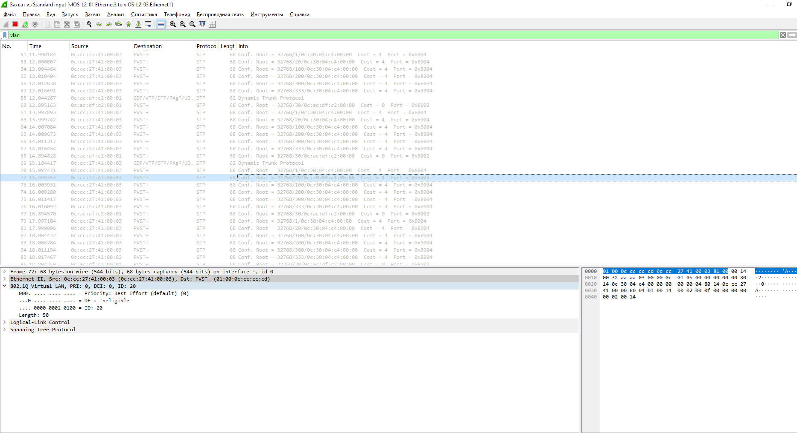
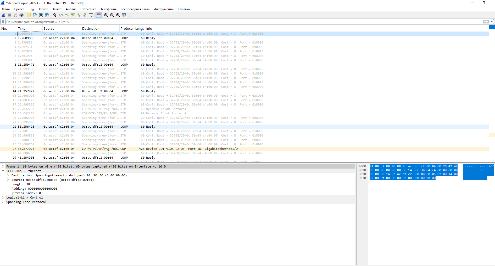
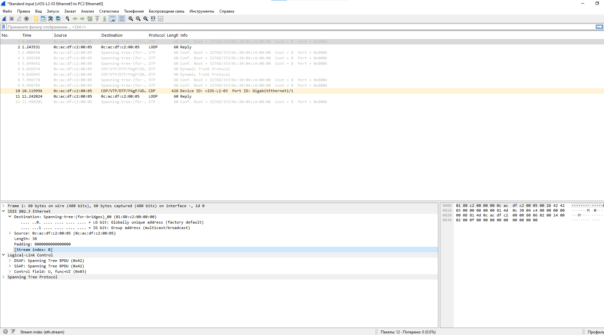

## Лабораторная работа №3 *"Настройка виртуальной локальной сети (VLAN)"*

Топология сети:



### 1) Для заданной на схеме schema-lab3 сети, состоящей из управляемых коммутаторов и персональных компьютеров настроить на коммутаторах логическую топологию используя протокол IEEE 802.1Q, для передачи пакетов VLAN333 между коммутаторами использовать Native VLAN

Для настройки vlan настроим каждый порт коммутаторов на определённый режим(acess/trunk):

#### Настройка устройства: *vIOS-L2-01*

```

# Создание vlan  

enable
config t
vlan 20
name VLAN20
exit
vlan 333
name VLAN333
exit

# Настройка интерфейса e0 - trunk

interface Gi0/0
switchport trunk encapsulation dot1q
switchport mode trunk
exit

# Настройка интерфейса e3 - trunk

interface Gi0/3
switchport trunk encapsulation dot1q
switchport mode trunk
exit

# Настройка интерфейса e4 - trunk

interface Gi1/0
switchport trunk encapsulation dot1q
switchport mode trunk
exit

# Запись конфигурации в ПЗУ

exit
write

```

Проверка:

```

show interfaces status

Port      Name               Status       Vlan       Duplex  Speed Type
Gi0/0                        connected    trunk        auto   auto unknown
Gi0/3                        connected    trunk        auto   auto unknown
Gi1/0                        connected    trunk        auto   auto unknown

```

#### Настройка устройства: *vIOS-L2-02*

```

# Создание vlan  

enable
config t
vlan 20
name VLAN20
exit
vlan 333
name VLAN333
exit

# Настройка интерфейса e0 - trunk

interface Gi0/0
switchport trunk encapsulation dot1q
switchport mode trunk
exit

# Настройка интерфейса e6 - trunk

interface Gi1/2
switchport trunk encapsulation dot1q
switchport mode trunk
exit

# Запись конфигурации в ПЗУ

exit
write

```

Проверка:

```

show interfaces status

Port      Name               Status       Vlan       Duplex  Speed Type
Gi0/0                        connected    trunk        auto   auto unknown
Gi1/2                        connected    trunk        auto   auto unknown

```

#### Настройка устройства: *vIOS-L2-03*

```

# Создание vlan  

enable
config t
vlan 20
name VLAN20
exit
vlan 333
name VLAN333
exit

# Настройка интерфейса e1 - trunk

interface Gi0/1
switchport trunk encapsulation dot1q
switchport mode trunk
exit

# Настройка интерфейса e4 - access(vlan 20)

interface Gi1/0
switchport trunk encapsulation dot1q
switchport mode access
switchport access vlan 20
exit

# Настройка интерфейса e5 - access(vlan 333)

interface Gi1/1
switchport trunk encapsulation dot1q
switchport mode access
switchport access vlan 333
exit

# Запись конфигурации в ПЗУ

exit
write

```

Проверка:

```
show interfaces status

Gi0/1                        connected    trunk        auto   auto unknown
Gi1/0                        connected    20           auto   auto unknown
Gi1/1                        connected    333          auto   auto unknown

```

#### Настройка устройства: *vIOS-L2-04*

```

# Создание vlan  

enable
config t
vlan 20
name VLAN20
exit
vlan 333
name VLAN333
exit

# Настройка интерфейса e0 - trunk

interface Gi0/0
switchport trunk encapsulation dot1q
switchport mode trunk
exit

# Настройка интерфейса e4 - access(vlan 20)

interface Gi1/0
switchport trunk encapsulation dot1q
switchport mode access
switchport access vlan 20
exit

# Настройка интерфейса e5 - access(vlan 333)

interface Gi1/1
switchport trunk encapsulation dot1q
switchport mode access
switchport access vlan 333
exit

# Запись конфигурации в ПЗУ

exit
write

```

Проверка:

```

show interfaces status

Port      Name               Status       Vlan       Duplex  Speed Type
Gi0/0                        connected    trunk        auto   auto unknown
Gi1/0                        connected    20           auto   auto unknown
Gi1/1                        connected    333          auto   auto unknown

```

#### Настройка устройства: *vIOS-L2-05*

```

# Создание vlan  

enable
config t
vlan 20
name VLAN20
exit
vlan 333
name VLAN333
exit

# Настройка интерфейса e2 - trunk

interface Gi0/2
switchport trunk encapsulation dot1q
switchport mode trunk
exit

# Настройка интерфейса e4 - access(vlan 20)

interface Gi1/0
switchport trunk encapsulation dot1q
switchport mode access
switchport access vlan 20
exit

# Настройка интерфейса e5 - access(vlan 333)

interface Gi1/1
switchport trunk encapsulation dot1q
switchport mode access
switchport access vlan 333
exit

# Запись конфигурации в ПЗУ

exit
write

```

Проверка:

```

show interfaces status

Port      Name               Status       Vlan       Duplex  Speed Type
Gi0/2                        connected    trunk        auto   auto unknown
Gi1/0                        connected    20           auto   auto unknown
Gi1/1                        connected    333          auto   auto unknown

```

### 2) Проверить доступность персональных компьютеров, находящихся в одинаковых VLAN и недоступность находящихся в различных, результаты задокументировать.

Ping PC1 (vlan 20) -> PC2 (vlan 333):

```
ping 192.168.12.1

No gateway found

```

Ping PC1 (vlan 20) -> PC3 (vlan 20):

```
ping 192.168.11.2

84 bytes from 192.168.11.2 icmp_seq=1 ttl=64 time=8.118 ms
84 bytes from 192.168.11.2 icmp_seq=2 ttl=64 time=7.138 ms
84 bytes from 192.168.11.2 icmp_seq=3 ttl=64 time=6.366 ms
84 bytes from 192.168.11.2 icmp_seq=4 ttl=64 time=6.973 ms
84 bytes from 192.168.11.2 icmp_seq=5 ttl=64 time=8.227 ms

```

Ping PC2 (vlan 333) -> PC4 (vlan 333):

```
ping 192.168.12.2

84 bytes from 192.168.12.2 icmp_seq=1 ttl=64 time=7.000 ms
84 bytes from 192.168.12.2 icmp_seq=2 ttl=64 time=4.547 ms
84 bytes from 192.168.12.2 icmp_seq=3 ttl=64 time=10.165 ms
84 bytes from 192.168.12.2 icmp_seq=4 ttl=64 time=7.026 ms
84 bytes from 192.168.12.2 icmp_seq=5 ttl=64 time=5.611 ms

```

Ping PC2 (vlan 333) -> PC1 (vlan 20):

```
ping 192.168.11.1

No gateway found

```

### 3) Перехватить в WireShark пакеты с тегами и без тегов (nb!), результаты задокументировать.

Захват тэгированного пакета vlan 333(Frame 67) на Link vIOS-L2-01 e3 to vIOS-L2-03 e1:



Захват тэгированного пакета vlan 20(Frame 72) на Link vIOS-L2-01 e3 to vIOS-L2-03 e1:



Захват пакета без тэгов на Link vIOS-L2-03 e4 to PC1 e0(Frame 1):



Захват пакета без тэгов на Link vIOS-L2-03 54 to PC2 e0(Frame 1):



### 4) Сохранить файлы конфигураций устройств в виде набора файлов с именами, соответствующими именам устройств.

```
enable
sh run
```

Файлы конфигурации сохранены в ./configs