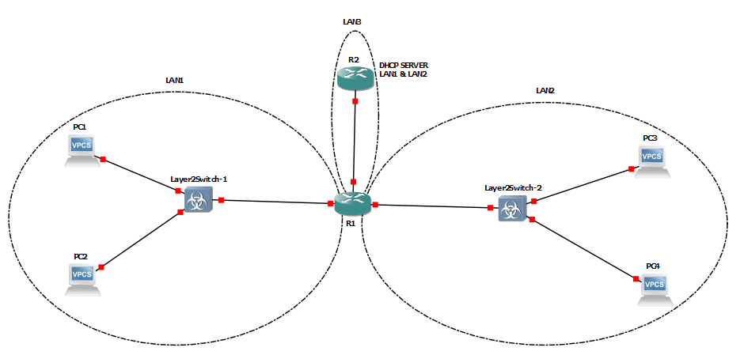
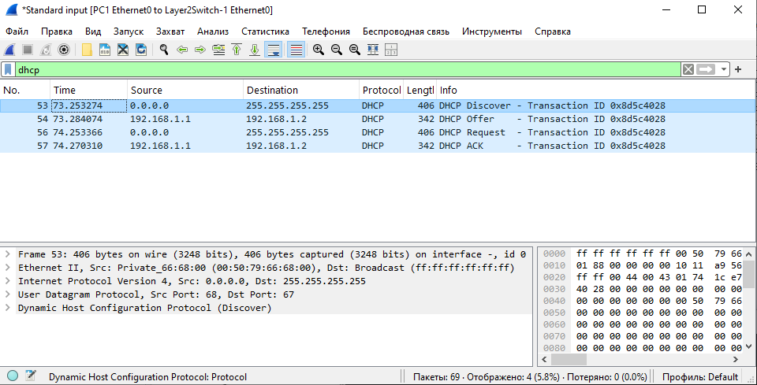

## Лабораторная работа №4 *"Настройка протокола DHCP"*

Топология сети:



### 1) Для заданной на схеме schema-lab4 сети, состоящей из управляемых коммутаторов, маршрутизаторов и персональных компьютеров выполнить планирование и документирование адресного пространства в подсетях LAN1, LAN2, LAN3 и назначить статические адреса маршрутизаторам и динамическое конфигурирование адресов для VPC.

Назначим статический адрес 192.168.0.2 маршрутизатору R2:

```
enable
config terminal

# Настройка интерфейса f0/0

interface f0/0
ip address 192.168.0.2 255.255.255.0
no shutdown
exit

# Запись конфигурации в ПЗУ

exit
write

```

Проверка:

```
show ip interface brief

Interface                  IP-Address      OK? Method Status                Protocol
FastEthernet0/0            192.168.0.2     YES manual up                    up   

```

Назначим статический адрес 192.168.0.1 маршрутизатору R1:

```
enable
config terminal

# Настройка интерфейса f1/0

interface f1/0
ip address 192.168.0.1 255.255.255.0
no shutdown
exit

# Настройка интерфейса f0/0

interface f0/0
ip address 192.168.1.1 255.255.255.0
no shutdown
exit

# Настройка интерфейса f2/0

interface f2/0
ip address 192.168.2.1 255.255.255.0
no shutdown
exit

# Запись конфигурации в ПЗУ

exit
write
```

Проверка:

```
show ip interface brief

Interface                  IP-Address      OK? Method Status                Protocol
FastEthernet0/0            192.168.1.1     YES manual up                    up                          
FastEthernet1/0            192.168.0.1     YES manual up                    up                          
FastEthernet2/0            192.168.2.1     YES manual up                    up                                
 
```

### 2) Настроить сервер DHCP на маршрутизаторе R2 для обслуживания адресных пулов адресного пространства подсетей LAN1 и LAN2.

Настроим DHCP сервер на маршрутизаторе R2:

```
enable
config terminal

# Настройка dhcp сервера на интерфейсе f0/0

interface f0/0
ip dhcp pool LAN1
network 192.168.1.0 255.255.255.0
default-router 192.168.0.2
dns-server 8.8.8.8
do wr
exit

ip dhcp pool LAN2
network 192.168.2.0 255.255.255.0
default-router 192.168.0.2
dns-server 8.8.8.8
do wr
exit

# Запись конфигурации в ПЗУ

exit
exit
write

```

Проверка

```

show ip dhcp pool

Pool LAN1 :
 Utilization mark (high/low)    : 100 / 0
 Subnet size (first/next)       : 0 / 0
 Total addresses                : 254
 Leased addresses               : 0
 Pending event                  : none
 1 subnet is currently in the pool :
 Current index        IP address range                    Leased addresses
 192.168.1.1          192.168.1.1      - 192.168.1.254     0

Pool LAN2 :
 Utilization mark (high/low)    : 100 / 0
 Subnet size (first/next)       : 0 / 0
 Total addresses                : 254
 Leased addresses               : 0
 Pending event                  : none
 1 subnet is currently in the pool :
 Current index        IP address range                    Leased addresses
 192.168.2.1          192.168.2.1      - 192.168.2.254     0

```

### 3) Настроить статическую (nb!) маршрутизацию между подсетями.

Настроим статическую машрутизацию между подсетями на маршрутизаторе R2:

```
enable
config terminal

# Конфигурация статического маршрута для LAN1

ip route 192.168.1.0 255.255.255.0 192.168.0.1

# Конфигурация статического маршрута для LAN2

ip route 192.168.2.0 255.255.255.0 192.168.0.1

exit

# Запись конфигурации в ПЗУ

write

```

Проверка:

```

show ip route

C    192.168.0.0/24 is directly connected, FastEthernet0/0
S    192.168.1.0/24 [1/0] via 192.168.0.1
S    192.168.2.0/24 [1/0] via 192.168.0.1

```

Настроим dhcp relay на маршрутизаторе R1:

```
enable
config terminal
interface f0/0
ip helper-address 192.168.0.2
exit
interface f2/0
ip helper-address 192.168.0.2
exit

# Запись конфигурации в ПЗУ

write

```

Проверка:

```
show ip interface f0/0 | include helper

FastEthernet0/0 is up, line protocol is up
  Helper address is 192.168.0.2

show ip interface f2/0 | include helper

FastEthernet2/0 is up, line protocol is up
  Helper address is 192.168.0.2

```

### 4) Проверить работоспособность протокола DHCP и маршрутизации, выполнив ping между всеми VPC.

#### Проверка отклика dhcp сервера

PC1:

```
ip dhcp
DDORA IP 192.168.1.2/24 GW 192.168.0.2
```

PC2:

```
ip dhcp
DDORA IP 192.168.1.3/24 GW 192.168.0.2
```

PC3:

```
ip dhcp
DDORA IP 192.168.2.2/24 GW 192.168.0.2
```

PC4:

```
ip dhcp
DDORA IP 192.168.2.3/24 GW 192.168.0.2
```

#### Ping

ping PC1 (192.168.1.2) -> PC2 (192.168.1.3):

```
ping 192.168.1.3

84 bytes from 192.168.1.3 icmp_seq=1 ttl=64 time=2.011 ms
84 bytes from 192.168.1.3 icmp_seq=2 ttl=64 time=0.674 ms
84 bytes from 192.168.1.3 icmp_seq=3 ttl=64 time=0.568 ms
84 bytes from 192.168.1.3 icmp_seq=4 ttl=64 time=4.948 ms
84 bytes from 192.168.1.3 icmp_seq=5 ttl=64 time=7.780 ms
```

ping PC1 (192.168.1.2) -> PC3 (192.168.2.2):

```
ping 192.168.2.2

84 bytes from 192.168.2.2 icmp_seq=1 ttl=64 time=0.523 ms
84 bytes from 192.168.2.2 icmp_seq=2 ttl=64 time=0.747 ms
84 bytes from 192.168.2.2 icmp_seq=3 ttl=64 time=5.720 ms
84 bytes from 192.168.2.2 icmp_seq=4 ttl=64 time=7.193 ms
84 bytes from 192.168.2.2 icmp_seq=5 ttl=64 time=1.489 ms

```

ping PC1 (192.168.1.2) -> PC4 (192.168.2.3):

```
ping 192.168.2.3

84 bytes from 192.168.2.3 icmp_seq=1 ttl=64 time=2.604 ms
84 bytes from 192.168.2.3 icmp_seq=2 ttl=64 time=0.533 ms
84 bytes from 192.168.2.3 icmp_seq=3 ttl=64 time=5.826 ms
84 bytes from 192.168.2.3 icmp_seq=4 ttl=64 time=1.536 ms
84 bytes from 192.168.2.3 icmp_seq=5 ttl=64 time=0.685 ms

```

### 5) Перехватить в wireshark диалог одного из VPC с сервером DHCP, разобрать с комментариями.

Захват dhcp диалога на линке PC1 e0 to Layer2Switch-1 e0:



#### Разбор DHCP-диалога между клиентом (VPC) и сервером


#### 1. DHCP Discover (Кадр 53)

##### Что происходит:

* Клиент (VPC) отправляет **DHCP Discover** в **широковещательном** режиме (```255.255.255.255```), чтобы найти доступные DHCP-серверы.

* Источник: ```0.0.0.0``` (клиент ещё не имеет IP).

* MAC-адрес клиента: ```00:50:79:66:68:00```.

* Transaction ID: ```0x8d5c4028``` (уникальный идентификатор для отслеживания запроса).

##### Комментарий:

* Это первый этап DHCP (DORA: Discover, Offer, Request, Ack).

* Клиент не знает адреса сервера, поэтому использует широковещательный запрос (```ff:ff:ff:ff:ff:ff``` на L2).

#### 2. DHCP Offer (Кадр 54)
##### Что происходит:

* Сервер (```192.168.1.1```) отвечает клиенту (```192.168.1.2```), предлагая IP-адрес.

* Transaction ID: ```0x8d5c4028``` (тот же, что в Discover).

* В кадре содержится:

  * Предлагаемый IP (```192.168.1.2```).

  * Маска подсети (```255.255.255.0```).

  * Шлюз (```192.168.1.1```).

  * DNS-сервер (если настроен).

##### Комментарий:

* Сервер резервирует IP для клиента, но не назначает его окончательно.

* Ответ тоже отправляется широковещательно (если клиент ещё не имеет IP).

#### 3. DHCP Request (Кадр 56)
##### Что происходит:

* Клиент подтверждает запрос на получение IP (```192.168.1.2```).

* Снова используется широковещательная рассылка (255.```255.255.255```).

* Transaction ID: ```0x8d5c4028``` (совпадает с предыдущими этапами).

##### Комментарий:

* Клиент формально "принимает" предложение сервера.

* Широковещательная отправка нужна, чтобы уведомить все DHCP-серверы (если их несколько).

#### 4. DHCP Ack (Кадр 57)
##### Что происходит:

* Сервер (```192.168.1.1```) подтверждает выделение IP (```192.168.1.2```) клиенту.

* В кадре содержится:

  * Назначенный IP.

  * Время аренды (lease time).

  * Доп. параметры (шлюз, DNS).

##### Комментарий:

* После этого клиент официально получает IP и может работать в сети.

* Если сервер не ответит Ack, клиент повторит процесс.

#### Выводы по процессу

1. DORA-процесс:

   * Discover → Offer → Request → Ack.

2. Широковещательные запросы:

   * Клиент не знает сервер, поэтому использует ```255.255.255.255``` (L3) и ```ff:ff:ff:ff:ff:ff``` (L2).

3. Transaction ID (0x8d5c4028):

   * Нужен для сопоставления запросов и ответов.

### 6) Сохранить файлы конфигураций устройств в виде набора файлов с именами, соответствующими именам устройств.

```
enable
sh run
```

Файлы конфигурации сохранены в ./configs