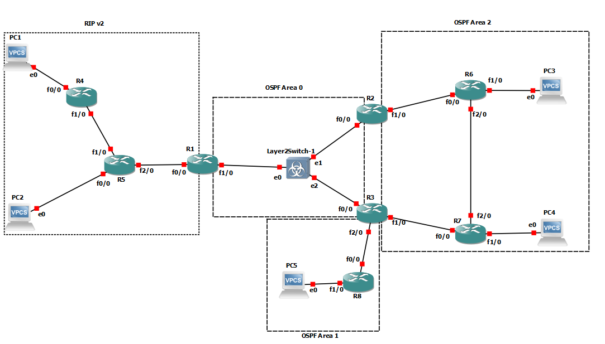
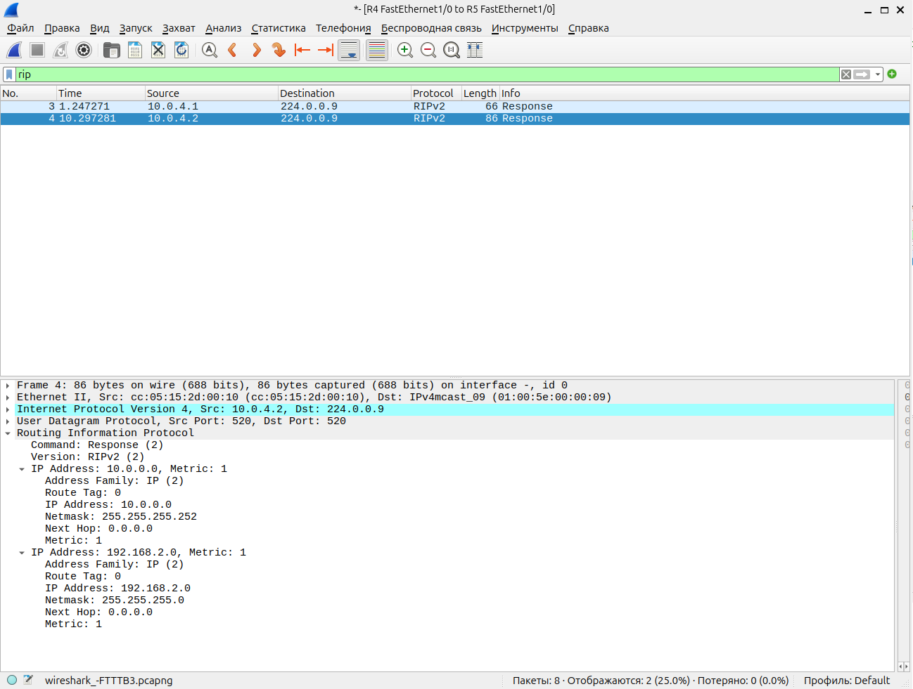
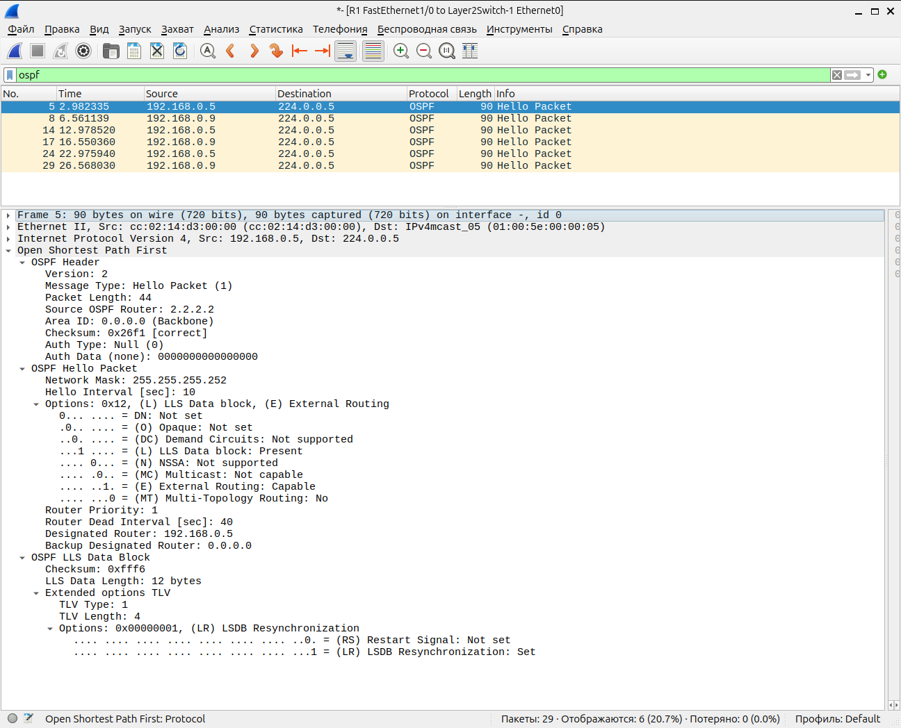

## Лабораторная работа №5 *"Настройка протоколов динамической маршрутизации RIP v2 и OSPF"*



### 1) Для заданной на схеме schema-lab5 сети, состоящей из управляемых коммутаторов, маршрутизаторов и персональных компьютеров выполнить планирование и документирование адресного пространства и назначить статические адреса всем устройствам. nb! Каждое соединение маршрутизатора с маршрутизатором - это отдельная сеть.

Планирование адресного пространства и настройка статических адресов:

1. Адресное пространство

Каждое соединение между маршрутизаторами — это отдельная сеть /30.

Подсети для пользовательских устройств (PC) — /24.

| Устройство | Интерфейс | Подсеть        | IP-адрес    | Маска           | Шлюз        | Примечание           |
|------------|-----------|----------------|-------------|-----------------|-------------|----------------------|
| PC1        | e0        | 192.168.1.0/24 | 192.168.1.2 | 255.255.255.0   | 192.168.1.1 | Подключен к R4       |
| PC2        | e0        | 192.168.2.0/24 | 192.168.2.2 | 255.255.255.0   | 192.168.2.1 | Подключен к R5       |
| PC3        | e0        | 192.168.3.0/24 | 192.168.3.2 | 255.255.255.0   | 192.168.3.1 | Подключен к R6       |
| PC4        | e0        | 192.168.4.0/24 | 192.168.4.2 | 255.255.255.0   | 192.168.4.1 | Подключен к R7       |
| PC5        | e0        | 192.168.5.0/24 | 192.168.5.2 | 255.255.255.0   | 192.168.5.1 | Подключен к R8       |
| R1         | f0/0      | 10.0.0.0/30    | 10.0.0.1    | 255.255.255.252 | -           | Подключен к R5       |
|            | f1/0      | 192.168.0.0/30 | 192.168.0.1 | 255.255.255.252 | -           | Подключен к L2S1(e0) |
| R2         | f0/0      | 192.168.0.4/30 | 192.168.0.5 | 255.255.255.252 | -           | Подключен к L2S1(e1) |
|            | f1/0      | 10.0.1.0/30    | 10.0.1.1    | 255.255.255.252 | -           | Подключен к R6       |
| R3         | f0/0      | 192.168.0.8/30 | 192.168.0.9 | 255.255.255.252 | -           | Подключен к L2S1(e2) |
|            | f1/0      | 10.0.2.0/30    | 10.0.2.1    | 255.255.255.252 | -           | Подключен к R7       |
|            | f2/0      | 10.0.3.0/30    | 10.0.3.1    | 255.255.255.252 | -           | Подключен к R8       |
| R4         | f0/0      | 192.168.1.0/24 | 192.168.1.1 | 255.255.255.0   | -           | LAN для PC1          |
|            | f1/0      | 10.0.4.0/30    | 10.0.4.1    | 255.255.255.252 | -           | Подключен к R5       |
| R5         | f0/0      | 192.168.2.0/24 | 192.168.2.1 | 255.255.255.0   | -           | LAN для PC2          |
|            | f1/0      | 10.0.4.0/30    | 10.0.4.2    | 255.255.255.252 | -           | Подключен к R4       |
|            | f2/0      | 10.0.0.0/30    | 10.0.0.2    | 255.255.255.252 | -           | Подключен к R1       |
| R6         | f0/0      | 10.0.1.0/30    | 10.0.1.2    | 255.255.255.252 | -           | Подключен к R2       |
|            | f1/0      | 192.168.3.0/24 | 192.168.3.1 | 255.255.255.0   | -           | LAN для PC3          |
|            | f2/0      | 10.0.5.0/30    | 10.0.5.1    | 255.255.255.252 | -           | Подключен к R7       |
| R7         | f0/0      | 10.0.2.0/30    | 10.0.2.2    | 255.255.255.252 | -           | Подключен к R3       |
|            | f1/0      | 192.168.4.0/24 | 192.168.4.1 | 255.255.255.0   | -           | LAN для PC4          |
|            | f2/0      | 10.0.5.0/30    | 10.0.5.2    | 255.255.255.252 | -           | Подключен к R6       |
| R8         | f0/0      | 10.0.3.0/30    | 10.0.3.2    | 255.255.255.252 | -           | Подключен к R3       |
|            | f1/0      | 192.168.5.0/24 | 192.168.5.1 | 255.255.255.0   | -           | LAN для PC5          |

2. Команды для настройки статических IP-адресов:

PC1-PC5:

```

# PC1:
ip 192.168.1.2 255.255.255.0 192.168.1.1
save

# PC2:
ip 192.168.2.2 255.255.255.0 192.168.2.1
save

# PC3:
ip 192.168.3.2 255.255.255.0 192.168.3.1
save

# PC4:
ip 192.168.4.2 255.255.255.0 192.168.4.1
save

# PC5:
ip 192.168.5.2 255.255.255.0 192.168.5.1
save

```

R1:

```
enable
configure terminal
interface f0/0
ip address 10.0.0.1 255.255.255.252
no shutdown
exit
interface f1/0
ip address 192.168.0.1 255.255.255.252
no shutdown
exit
ip route 192.168.1.0 255.255.255.0 10.0.0.2
ip route 192.168.2.0 255.255.255.0 10.0.0.2
ip route 192.168.3.0 255.255.255.0 192.168.0.2
ip route 192.168.4.0 255.255.255.0 192.168.0.2
ip route 192.168.5.0 255.255.255.0 192.168.0.2
exit
write
```

R2:

```
enable
configure terminal
interface f0/0
ip address 192.168.0.5 255.255.255.252
no shutdown
exit
interface f1/0
ip address 10.0.1.1 255.255.255.252
no shutdown
exit
ip route 192.168.1.0 255.255.255.0 192.168.0.6
ip route 192.168.2.0 255.255.255.0 192.168.0.6
ip route 192.168.3.0 255.255.255.0 10.0.1.2
ip route 192.168.4.0 255.255.255.0 192.168.0.6
ip route 192.168.5.0 255.255.255.0 192.168.0.6
exit
write
```

R3:

```
enable
configure terminal
interface f0/0
ip address 192.168.0.9 255.255.255.252
no shutdown
exit
interface f1/0
ip address 10.0.2.1 255.255.255.252
no shutdown
exit
interface f2/0
ip address 10.0.3.1 255.255.255.252
no shutdown
exit
ip route 192.168.1.0 255.255.255.0 192.168.0.10
ip route 192.168.2.0 255.255.255.0 192.168.0.10
ip route 192.168.3.0 255.255.255.0 192.168.0.10
ip route 192.168.4.0 255.255.255.0 10.0.2.2
ip route 192.168.5.0 255.255.255.0 10.0.3.2
exit
write
```

R4:

```
enable
configure terminal
interface f0/0
ip address 192.168.1.1 255.255.255.0
no shutdown
exit
interface f1/0
ip address 10.0.4.1 255.255.255.252
no shutdown
exit
ip route 0.0.0.0 0.0.0.0 10.0.4.2
exit
write
```

R5:

```
enable
configure terminal
interface f0/0
ip address 192.168.2.1 255.255.255.0
no shutdown
exit
interface f1/0
ip address 10.0.4.2 255.255.255.252
no shutdown
exit
interface f2/0
ip address 10.0.0.2 255.255.255.252
no shutdown
exit
ip route 192.168.1.0 255.255.255.0 10.0.4.1
ip route 192.168.3.0 255.255.255.0 10.0.0.1
ip route 192.168.4.0 255.255.255.0 10.0.0.1
ip route 192.168.5.0 255.255.255.0 10.0.0.1
exit
write
```

R6:

```
enable
configure terminal
interface f0/0
ip address 10.0.1.2 255.255.255.252
no shutdown
exit
interface f1/0
ip address 192.168.3.1 255.255.255.0
no shutdown
exit
interface f2/0
ip address 10.0.5.1 255.255.255.252
no shutdown
exit
ip route 192.168.1.0 255.255.255.0 10.0.1.1
ip route 192.168.2.0 255.255.255.0 10.0.1.1
ip route 192.168.4.0 255.255.255.0 10.0.5.2
ip route 192.168.5.0 255.255.255.0 10.0.1.1
exit
write
```

R7:

```
enable
configure terminal
interface f0/0
ip address 10.0.2.2 255.255.255.252
no shutdown
exit
interface f1/0
ip address 192.168.4.1 255.255.255.0
no shutdown
exit
interface f2/0
ip address 10.0.5.2 255.255.255.252
no shutdown
exit
ip route 192.168.1.0 255.255.255.0 10.0.2.1
ip route 192.168.2.0 255.255.255.0 10.0.2.1
ip route 192.168.3.0 255.255.255.0 10.0.5.1
ip route 192.168.5.0 255.255.255.0 10.0.2.1
exit
write
```

R8:

```
enable
configure terminal
interface f0/0
ip address 10.0.3.2 255.255.255.252
no shutdown
exit
interface f1/0
ip address 192.168.5.1 255.255.255.0
no shutdown
exit
ip route 0.0.0.0 0.0.0.0 10.0.3.1
exit
write
```

### 2) Настроить протокол динамической маршрутизации RIP v2 для области, указанной на схеме schema-lab5.

Настройка RIP v2 на маршрутизаторах R4 и R5:

R4:

```
enable
configure terminal

# Включаем RIP и задаем версию 2
router rip
version 2

# LAN для PC1
network 192.168.1.0

# Сеть между R4 и R5
network 10.0.4.0

# Отключаем автоматическую суммаризацию
no auto-summary        

exit
write
```

R5:

```
enable
configure terminal

# Включаем RIP и задаем версию 2
router rip
version 2

# LAN для PC2
network 192.168.2.0

# Сеть между R5 и R1
network 10.0.0.0

# Сеть между R5 и R4       
network 10.0.4.0

# Отключаем автоматическую суммаризацию       
no auto-summary        

exit
write
```

### 3) Настроить протокол динамической маршрутизации OSPF для зон 0, 1, 2. Зону 1 настроить как полностью (nb!) тупиковую.

Настройка зоны 0 (OSPF Area 0) - R1, R2, R3:

```
enable
configure terminal

# R1 (подключен к R5 через 10.0.0.0/30 и к L2S1 через 192.168.0.0/30)
router ospf 1
router-id 1.1.1.1

# Сеть R1-R5
network 10.0.0.0 0.0.0.3 area 0

# Сеть R1-L2S1
network 192.168.0.0 0.0.0.3 area 0

# Интерфейс в сторону коммутатора
passive-interface f1/0   
exit

# R2 (подключен к R6 через 10.0.1.0/30 и к L2S1 через 192.168.0.4/30)
router ospf 1
router-id 2.2.2.2

# Сеть R2-R6
network 10.0.1.0 0.0.0.3 area 0

# Сеть R2-L2S1
network 192.168.0.4 0.0.0.3 area 0  
exit

# R3 (подключен к R7 через 10.0.2.0/30, к R8 через 10.0.3.0/30 и к L2S1 через 192.168.0.8/30)
router ospf 1
router-id 3.3.3.3

# Сеть R3-R7 (зона 1)
network 10.0.2.0 0.0.0.3 area 0

# Сеть R3-R8 (зона 2)
network 10.0.3.0 0.0.0.3 area 2    

# Сеть R3-L2S1
network 192.168.0.8 0.0.0.3 area 0  

exit
```

Настройка зоны 1 (OSPF Area 1 - Totally Stubby Area) - R6, R7:

```
enable
config terminal

# R6 (подключен к R2 через 10.0.1.0/30 и к R7 через 10.0.5.0/30)
router ospf 1
router-id 6.6.6.6
network 10.0.1.0 0.0.0.3 area 0    # Связь с R2 (зона 0)
network 10.0.5.0 0.0.0.3 area 1    # Связь с R7 (зона 1)
network 192.168.3.0 0.0.0.255 area 1  # LAN PC3
area 1 stub no-summary              # Делаем зону 1 полностью тупиковой
exit

# R7 (подключен к R3 через 10.0.2.0/30 и к R6 через 10.0.5.0/30)
router ospf 1
router-id 7.7.7.7
network 10.0.2.0 0.0.0.3 area 0    # Связь с R3 (зона 0)
network 10.0.5.0 0.0.0.3 area 1    # Связь с R6 (зона 1)
network 192.168.4.0 0.0.0.255 area 1  # LAN PC4
area 1 stub                        # Указываем, что зона 1 - stub (на R7 без no-summary)
exit
```

Настройка зоны 2 (OSPF Area 2) - R8:

```
enable
config terminal
# R8 (подключен к R3 через 10.0.3.0/30)
router ospf 1
router-id 8.8.8.8
network 10.0.3.0 0.0.0.3 area 2    # Связь с R3
network 192.168.5.0 0.0.0.255 area 2  # LAN PC5
exit
```

### 4) Настроить редистрибуцию маршрутов между протоколами RIP v2 и OSPF.

Настройка редистрибуции между RIP v2 и OSPF

Для обмена маршрутами между RIP и OSPF необходимо выполнить редистрибуцию на пограничных маршрутизаторах, которые работают с обоими протоколами. В нашей топологии это:

* R1 (соединяет RIP через R5 и OSPF через зону 0)

* R2 (соединяет RIP через R6 и OSPF через зону 0)

* R3 (соединяет RIP через R7/R8 и OSPF через зону 0)

1. Настройка редистрибуции на R1:

```
enable
configure terminal

# Редистрибуция из RIP в OSPF
router ospf 1
redistribute rip subnets  # Импорт RIP-маршрутов в OSPF (с учётом масок)
default-metric 20         # Задаём метрику для импортируемых маршрутов (опционально)
exit

# Редистрибуция из OSPF в RIP
router rip
redistribute ospf 1      # Импорт OSPF-маршрутов в RIP
default-metric 3         # Задаём метрику для импортируемых маршрутов (1-15)
exit

write
```

2. Настройка редистрибуции на R2:

```
enable
configure terminal

# Редистрибуция из RIP в OSPF
router ospf 1
redistribute rip subnets
default-metric 20
exit

# Редистрибуция из OSPF в RIP
router rip
redistribute ospf 1
default-metric 3
exit

write
```

3. Настройка редистрибуции на R3:

```
enable
configure terminal

# Редистрибуция из RIP в OSPF
router ospf 1
redistribute rip subnets
default-metric 20
exit

# Редистрибуция из OSPF в RIP
router rip
redistribute ospf 1
default-metric 3
exit

write
```

### 5) Проверить работоспособность маршрутизации, выполнив ping VPC "все между всеми" (nb!: в обе стороны).

Чтобы убедиться, что маршрутизация работает корректно, необходимо проверить связность между всеми ПК (PC1-PC5) в обе стороны. Для этого выполним ping между каждой парой устройств.

1. Проверка связности между VPC

Схема подключения:

PC1 (192.168.1.2) → R4 → R5 → R1 → R2 → R6 → PC3 (192.168.3.2)

PC2 (192.168.2.2) → R5 → R1 → R3 → R7 → PC4 (192.168.4.2)

PC5 (192.168.5.2) → R8 → R3 → R2 → R6 → PC3 (192.168.3.2)

2. Команды для проверки ping

На PC1 (192.168.1.2)

```
# Ввод

ping 192.168.2.2 -c 1  # PC2 (через RIP → OSPF → RIP)
ping 192.168.3.2 -c 1  # PC3 (через OSPF)
ping 192.168.4.2 -c 1  # PC4 (через OSPF → Totally Stubby Area)
ping 192.168.5.2 -c 1  # PC5 (через OSPF → Area 2)

# Вывод

84 bytes from 192.168.2.2 icmp_seq=1 ttl=62 time=23.932 ms
84 bytes from 192.168.3.2 icmp_seq=1 ttl=62 time=25.736 ms
84 bytes from 192.168.4.2 icmp_seq=1 ttl=62 time=25.069 ms
84 bytes from 192.168.5.2 icmp_seq=1 ttl=62 time=26.326 ms


```

На PC2 (192.168.2.2)

```
# Ввод

ping 192.168.1.2 -c 1  # PC1 (через RIP → OSPF → RIP)
ping 192.168.3.2 -c 1  # PC3 (через OSPF)
ping 192.168.4.2 -c 1  # PC4 (через OSPF → Totally Stubby Area)
ping 192.168.5.2 -c 1  # PC5 (через OSPF → Area 2)

# Вывод

84 bytes from 192.168.1.2 icmp_seq=1 ttl=62 time=39.993 ms
84 bytes from 192.168.3.2 icmp_seq=1 ttl=62 time=22.035 ms
84 bytes from 192.168.4.2 icmp_seq=1 ttl=62 time=29.100 ms
84 bytes from 192.168.5.2 icmp_seq=1 ttl=62 time=28.031 ms
```

На PC3 (192.168.3.2)

```
# Ввод

ping 192.168.1.2 -c 1  # PC1 (через OSPF → RIP)
ping 192.168.2.2 -c 1  # PC2 (через OSPF → RIP)
ping 192.168.4.2 -c 1  # PC4 (через Totally Stubby Area)
ping 192.168.5.2 -c 1  # PC5 (через OSPF → Area 2)

# Вывод

84 bytes from 192.168.1.2 icmp_seq=1 ttl=62 time=39.507 ms
84 bytes from 192.168.2.2 icmp_seq=1 ttl=62 time=30.317 ms
84 bytes from 192.168.4.2 icmp_seq=1 ttl=62 time=23.740 ms
84 bytes from 192.168.5.2 icmp_seq=1 ttl=62 time=23.606 ms

```

На PC4 (192.168.4.2)

```
# Ввод

ping 192.168.1.2 -c 1  # PC1 (через Totally Stubby → OSPF → RIP)
ping 192.168.2.2 -c 1  # PC2 (через Totally Stubby → OSPF → RIP)
ping 192.168.3.2 -c 1  # PC3 (через Totally Stubby Area)
ping 192.168.5.2 -c 1  # PC5 (через OSPF → Area 2)

# Вывод

84 bytes from 192.168.1.2 icmp_seq=1 ttl=62 time=23.166 ms
84 bytes from 192.168.2.2 icmp_seq=1 ttl=62 time=22.833 ms
84 bytes from 192.168.3.2 icmp_seq=1 ttl=62 time=21.781 ms
84 bytes from 192.168.5.2 icmp_seq=1 ttl=62 time=27.525 ms

```

На PC5 (192.168.5.2)

```
# Ввод

ping 192.168.1.2 -c 1  # PC1 (через Area 2 → OSPF → RIP)
ping 192.168.2.2 -c 1  # PC2 (через Area 2 → OSPF → RIP)
ping 192.168.3.2 -c 1  # PC3 (через Area 2 → OSPF)
ping 192.168.4.2 -c 1  # PC4 (через Area 2 → OSPF → Totally Stubby)

# Вывод

84 bytes from 192.168.1.2 icmp_seq=1 ttl=62 time=22.211 ms
84 bytes from 192.168.2.2 icmp_seq=1 ttl=62 time=28.945 ms
84 bytes from 192.168.3.2 icmp_seq=1 ttl=62 time=27.987 ms
84 bytes from 192.168.4.2 icmp_seq=1 ttl=62 time=22.383 ms

```

### 6) Перехватить в wireshark сообщения протоколов RIP v2 и OSPF, идентифицировать их тип и содержание.


Захват протокола RIPv2 на линке R4 f1/0 to R5 f1/0:



Захват протокола OSPF на линке R1 f1/0 to Layer2Switch-1 e0:



Анализ захваченных пакетов RIP v2 и OSPF

#### 1. Пакет RIP v2 (из image-1.png)

Тип: Response (ответ RIP v2).

Источник: 10.0.4.1

Назначение: Multicast 224.0.0.9 (стандартный адрес для RIP v2).

Содержание:

* Маршрут: 192.168.1.0/24 с метрикой 1.

* Версия: RIPv2 (Version: 2).

Поля:

* Address Family: IP (2).

* Next Hop: 0.0.0.0 (отправляющий маршрутизатор).

* Metric: 1 (расстояние до сети).

Это периодическое обновление RIP v2, где маршрутизатор анонсирует сеть 192.168.1.0/24. Метрика 1 указывает, что сеть непосредственно подключена.

#### 2. Пакет OSPF

Тип: Hello Packet (установка/поддержание соседства).

Источник: 192.168.0.5 (R2).

Назначение: Multicast 224.0.0.5 (All OSPF Routers).

Содержание:

* Зона: Backbone (Area ID: 0.0.0.0).

Параметры:

* Hello Interval: 10 sec.

* Router Dead Interval: 40 sec.

* Designated Router (DR): 192.168.0.5 (R2 является DR).

* Options: LLS Data block, External Routing.

* Router ID: 2.2.2.2.

Это Hello-пакет OSPF, используемый для обнаружения соседей. R2 (DR) поддерживает связь в зоне 0 (Backbone). Наличие External Routing в Options указывает на поддержку внешних маршрутов (например, из RIP).

### 7) Сохранить в отдельные файлы с префиксом rt_ и именем маршрутизатора таблицы маршрутизации всех маршрутизаторов.

Выполнить на каждом маршрутизаторе:

```
show ip route
```

Файлы таблиц маршрутизации сохранены в ./configs с префиксом rt_

### 8) Сохранить файлы конфигураций устройств в виде набора файлов с именами, соответствующими именам устройств.

Выполнить на каждом устройстве:

```
enable
sh run
```

Файлы конфигурации сохранены в ./configs