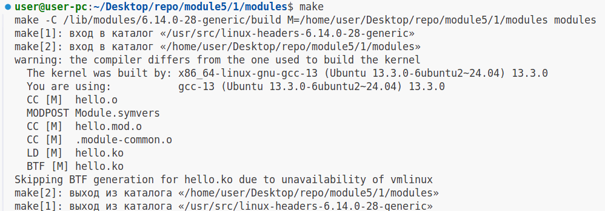
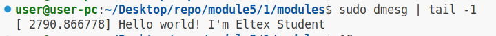
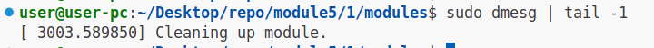
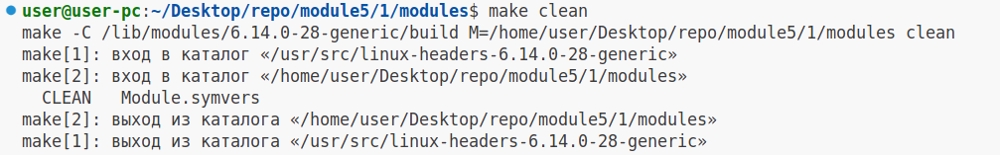

# Задание №1

### 1.Установим необходимые заголовки (используем apt package manager)

```
sudo apt-get install build-essential linux-headers-$(uname -r)
```

### 2.Соберём модуль ядра:

```
make

make -C /lib/modules/6.14.0-28-generic/build M=/home/user/Desktop/repo/module5/1/modules modules
make[1]: вход в каталог «/usr/src/linux-headers-6.14.0-28-generic»
make[2]: вход в каталог «/home/user/Desktop/repo/module5/1/modules»
warning: the compiler differs from the one used to build the kernel
  The kernel was built by: x86_64-linux-gnu-gcc-13 (Ubuntu 13.3.0-6ubuntu2~24.04) 13.3.0
  You are using:           gcc-13 (Ubuntu 13.3.0-6ubuntu2~24.04) 13.3.0
  CC [M]  hello.o
  MODPOST Module.symvers
  CC [M]  hello.mod.o
  CC [M]  .module-common.o
  LD [M]  hello.ko
  BTF [M] hello.ko
Skipping BTF generation for hello.ko due to unavailability of vmlinux
make[2]: выход из каталога «/home/user/Desktop/repo/module5/1/modules»
make[1]: выход из каталога «/usr/src/linux-headers-6.14.0-28-generic»
```

### Скриншот



### 3.Добавим модуль в ядро "Наживую"

```
sudo insmod hello.ko
```

Проверим загрузку модуля:

```
sudo dmesg | tail -1

[ 2790.866778] Hello world! I'm Eltex Student

```

### Скриншот



### 4.Выгрузим модуль из ядра

```
sudo rmmod hello.ko
```

Проверим выгрузку модуля:

```
sudo dmesg | tail -1

[ 3003.589850] Cleaning up module.
```

### Скриншот



### 5.Выполним цель билда clean в make

```
make clean

make -C /lib/modules/6.14.0-28-generic/build M=/home/user/Desktop/repo/module5/1/modules clean
make[1]: вход в каталог «/usr/src/linux-headers-6.14.0-28-generic»
make[2]: вход в каталог «/home/user/Desktop/repo/module5/1/modules»
  CLEAN   Module.symvers
make[2]: выход из каталога «/home/user/Desktop/repo/module5/1/modules»
make[1]: выход из каталога «/usr/src/linux-headers-6.14.0-28-generic»
```

### Скриншот

