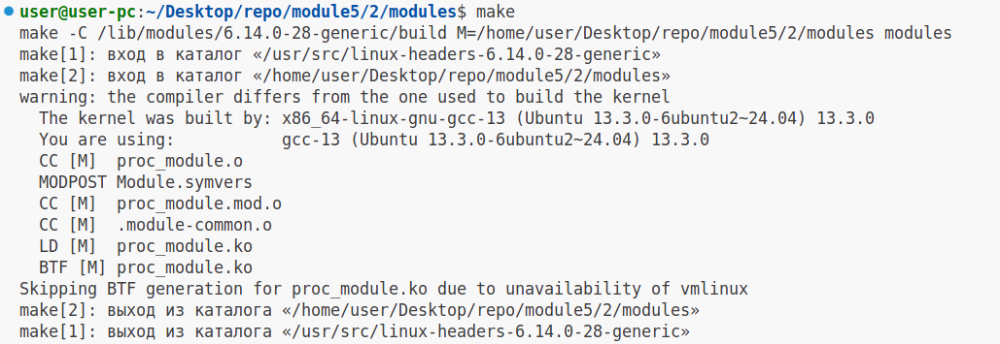
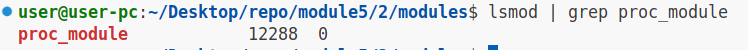
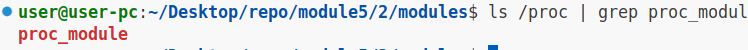
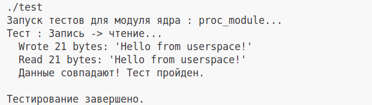
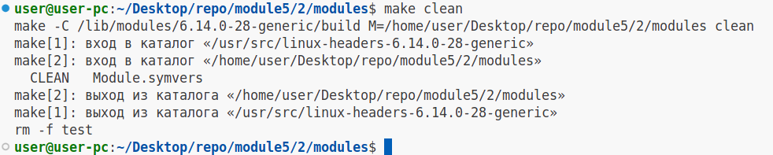

# Задание №2

### 1.Установим необходимые заголовки (используем apt package manager)

```
sudo apt-get install build-essential linux-headers-$(uname -r)
```

### 2.Соберём модуль ядра:

```
make

# Вывод

make -C /lib/modules/6.14.0-28-generic/build M=/home/user/Desktop/repo/module5/2/modules modules
make[1]: вход в каталог «/usr/src/linux-headers-6.14.0-28-generic»
make[2]: вход в каталог «/home/user/Desktop/repo/module5/2/modules»
warning: the compiler differs from the one used to build the kernel
  The kernel was built by: x86_64-linux-gnu-gcc-13 (Ubuntu 13.3.0-6ubuntu2~24.04) 13.3.0
  You are using:           gcc-13 (Ubuntu 13.3.0-6ubuntu2~24.04) 13.3.0
  CC [M]  proc_module.o
  MODPOST Module.symvers
  CC [M]  proc_module.mod.o
  CC [M]  .module-common.o
  LD [M]  proc_module.ko
  BTF [M] proc_module.ko
Skipping BTF generation for proc_module.ko due to unavailability of vmlinux
make[2]: выход из каталога «/home/user/Desktop/repo/module5/2/modules»
make[1]: выход из каталога «/usr/src/linux-headers-6.14.0-28-generic»

```

#### Скриншот



### 3.Добавим модуль в ядро "Наживую"

```
sudo insmod proc_module.ko
```

Проверим загрузку модуля:

```
lsmod | grep proc_module

# Вывод

proc_module            12288  0

```

#### Скриншот



### 4.Проверим наличие файла в /proc

```
ls /proc | grep proc_module

# Вывод

proc_module

```

#### Скриншот



### 5.Запустим тестирующую программу (test.c)

```

gcc test.c -o test
./test

# Вывод

Запуск тестов для модуля ядра : proc_module...
Тест : Запись -> чтение...
  Wrote 21 bytes: 'Hello from userspace!'
  Read 21 bytes: 'Hello from userspace!'
  Данные совпадают! Тест пройден.

Тестирование завершено.

```

#### Скриншот



### 5.Выгрузим модуль из ядра

```
sudo rmmod proc_module
```

### 6.Выполним цель билда clean в make

```
make clean

# Вывод

make -C /lib/modules/6.14.0-28-generic/build M=/home/user/Desktop/repo/module5/2/modules clean
make[1]: вход в каталог «/usr/src/linux-headers-6.14.0-28-generic»
make[2]: вход в каталог «/home/user/Desktop/repo/module5/2/modules»
  CLEAN   Module.symvers
make[2]: выход из каталога «/home/user/Desktop/repo/module5/2/modules»
make[1]: выход из каталога «/usr/src/linux-headers-6.14.0-28-generic»
rm -f test

```

### Скриншот

