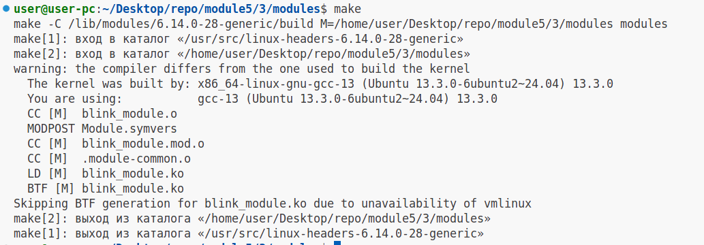
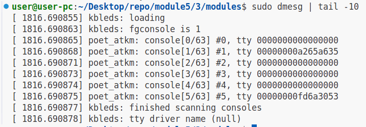
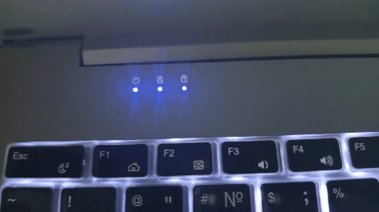
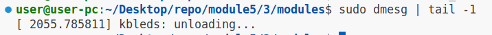
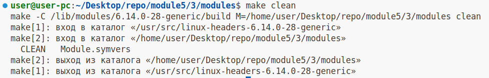

# Задание №3

### 1.Установим необходимые заголовки (используем apt package manager)

```
sudo apt-get install build-essential linux-headers-$(uname -r)
```

### 2.Соберём модуль ядра:

```
make

# Вывод

make -C /lib/modules/6.14.0-28-generic/build M=/home/user/Desktop/repo/module5/3/modules modules
make[1]: вход в каталог «/usr/src/linux-headers-6.14.0-28-generic»
make[2]: вход в каталог «/home/user/Desktop/repo/module5/3/modules»
warning: the compiler differs from the one used to build the kernel
  The kernel was built by: x86_64-linux-gnu-gcc-13 (Ubuntu 13.3.0-6ubuntu2~24.04) 13.3.0
  You are using:           gcc-13 (Ubuntu 13.3.0-6ubuntu2~24.04) 13.3.0
  CC [M]  blink_module.o
  MODPOST Module.symvers
  CC [M]  blink_module.mod.o
  CC [M]  .module-common.o
  LD [M]  blink_module.ko
  BTF [M] blink_module.ko
Skipping BTF generation for blink_module.ko due to unavailability of vmlinux
make[2]: выход из каталога «/home/user/Desktop/repo/module5/3/modules»
make[1]: выход из каталога «/usr/src/linux-headers-6.14.0-28-generic»

```

### Скриншот




### 3.Добавим модуль в ядро "Наживую"

```
sudo insmod blink_module.ko
```

Проверим загрузку модуля:

```
sudo dmesg | tail -10

# Вывод

[ 1816.690855] kbleds: loading
[ 1816.690863] kbleds: fgconsole is 1
[ 1816.690865] poet_atkm: console[0/63] #0, tty 0000000000000000
[ 1816.690868] poet_atkm: console[1/63] #1, tty 00000000a265a635
[ 1816.690871] poet_atkm: console[2/63] #2, tty 0000000000000000
[ 1816.690873] poet_atkm: console[3/63] #3, tty 0000000000000000
[ 1816.690874] poet_atkm: console[4/63] #4, tty 0000000000000000
[ 1816.690875] poet_atkm: console[5/63] #5, tty 00000000fd6a3053
[ 1816.690877] kbleds: finished scanning consoles
[ 1816.690878] kbleds: tty driver name (null)

```

### Скриншот



### 4. Проверим работу модуля(Мигают ли светодиоды?)

Режимы(state):

0 - все светодиоды 1 - caps_lock 2 - num_lock в /sys/kernel/blink/state

```
sudo cat /sys/kernel/blink/state

0
```




### 5.Выгрузим модуль из ядра

```
sudo rmmod blink_module
```

Проверим выгрузку модуля:

```
sudo dmesg | tail -1

# Вывод

[ 2055.785811] kbleds: unloading...
```

### Скриншот



### 6.Выполним цель билда clean в make

```
make clean

# Вывод

make -C /lib/modules/6.14.0-28-generic/build M=/home/user/Desktop/repo/module5/3/modules clean
make[1]: вход в каталог «/usr/src/linux-headers-6.14.0-28-generic»
make[2]: вход в каталог «/home/user/Desktop/repo/module5/3/modules»
  CLEAN   Module.symvers
make[2]: выход из каталога «/home/user/Desktop/repo/module5/3/modules»
make[1]: выход из каталога «/usr/src/linux-headers-6.14.0-28-generic»
```

### Скриншот


