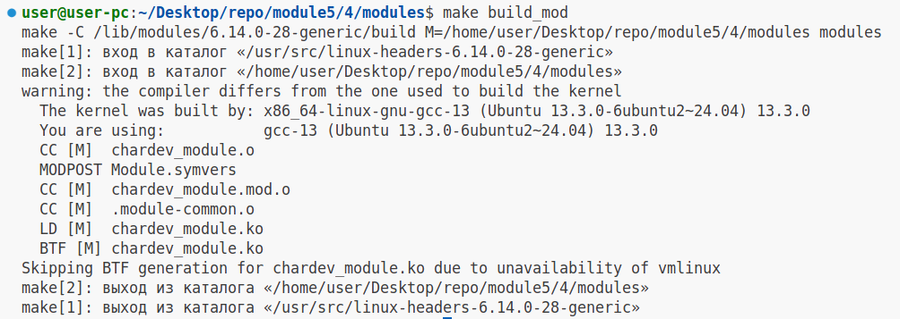
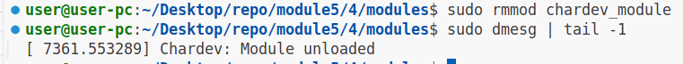
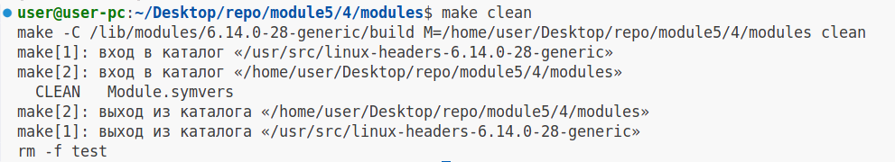

# Задание №4

### 1.Установим необходимые заголовки (используем apt package manager)

```
sudo apt-get install build-essential linux-headers-$(uname -r)
```

### 2.Соберём модуль ядра:

```
make build_mod

# Вывод

make -C /lib/modules/6.14.0-28-generic/build M=/home/user/Desktop/repo/module5/4/modules modules
make[1]: вход в каталог «/usr/src/linux-headers-6.14.0-28-generic»
make[2]: вход в каталог «/home/user/Desktop/repo/module5/4/modules»
warning: the compiler differs from the one used to build the kernel
  The kernel was built by: x86_64-linux-gnu-gcc-13 (Ubuntu 13.3.0-6ubuntu2~24.04) 13.3.0
  You are using:           gcc-13 (Ubuntu 13.3.0-6ubuntu2~24.04) 13.3.0
  CC [M]  chardev_module.o
  MODPOST Module.symvers
  CC [M]  chardev_module.mod.o
  CC [M]  .module-common.o
  LD [M]  chardev_module.ko
  BTF [M] chardev_module.ko
Skipping BTF generation for chardev_module.ko due to unavailability of vmlinux
make[2]: выход из каталога «/home/user/Desktop/repo/module5/4/modules»
make[1]: выход из каталога «/usr/src/linux-headers-6.14.0-28-generic»

```

#### Скриншот



### 3.Добавим модуль в ядро "Наживую"

```
make insert_mod
```

Проверим загрузку модуля:

```
sudo dmesg | tail -1

# Вывод

[ 7080.037947] Chardev: Module initialized successfully

```

#### Скриншот


### 4.Проверим наличие файла в /dev

```
ls /dev | grep my_chardev

# Вывод

my_chardev

```

#### Скриншот


### 5.Запустим тестирующую программу (test.c)

```

make run_test

# Вывод

cc test.c -o test
sudo ./test
Запуск тестов для модуля ядра : chardev_module...
Запись в устройство...
Записано 21 байт: Hello from userspace!
Чтение из устройства...
Прочитано 21 байт: Hello from userspace!
Данные совпадают! Тест пройден.

```

#### Скриншот


### 6.Выгрузим модуль из ядра

```
sudo rmmod chardev_module
```

Проверим выгрузку модуля:

```
sudo dmesg | tail -1

# Вывод

[ 7361.553289] Chardev: Module unloaded

```

#### Скриншот



### 7.Выполним цель билда clean в make

```
make clean

# Вывод

make -C /lib/modules/6.14.0-28-generic/build M=/home/user/Desktop/repo/module5/4/modules clean
make[1]: вход в каталог «/usr/src/linux-headers-6.14.0-28-generic»
make[2]: вход в каталог «/home/user/Desktop/repo/module5/4/modules»
  CLEAN   Module.symvers
make[2]: выход из каталога «/home/user/Desktop/repo/module5/4/modules»
make[1]: выход из каталога «/usr/src/linux-headers-6.14.0-28-generic»
rm -f test

```

### Скриншот


