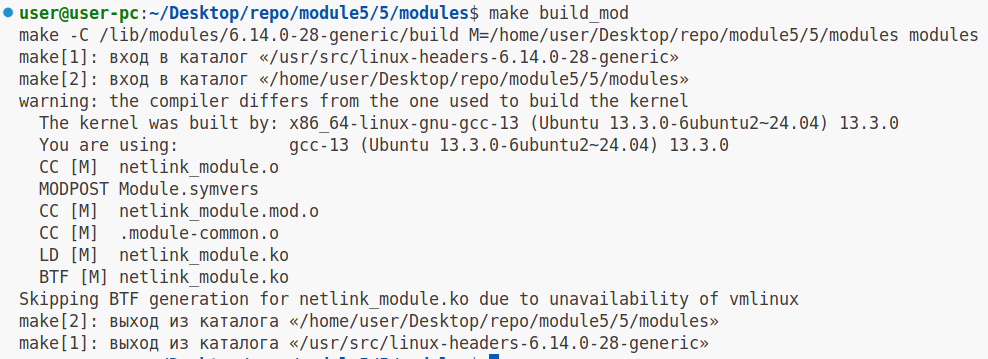
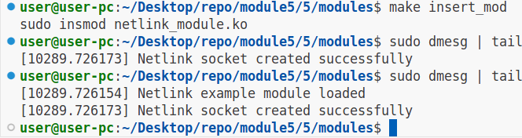
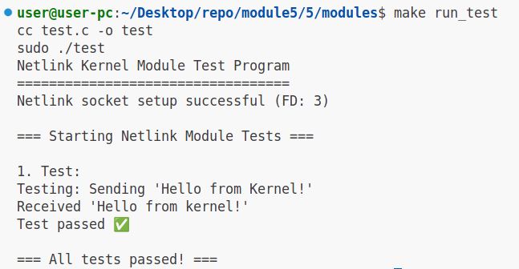
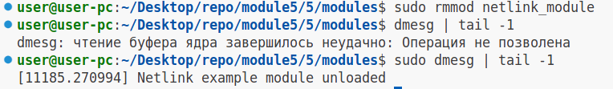
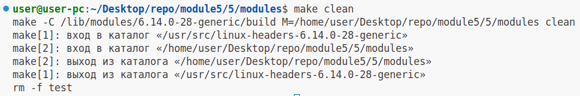

# Задание №5

### 1.Установим необходимые заголовки (используем apt package manager)

```
sudo apt-get install build-essential linux-headers-$(uname -r)
```

### 2.Соберём модуль ядра:

```
make build_mod

# Вывод

make -C /lib/modules/6.14.0-28-generic/build M=/home/user/Desktop/repo/module5/5/modules modules
make[1]: вход в каталог «/usr/src/linux-headers-6.14.0-28-generic»
make[2]: вход в каталог «/home/user/Desktop/repo/module5/5/modules»
warning: the compiler differs from the one used to build the kernel
  The kernel was built by: x86_64-linux-gnu-gcc-13 (Ubuntu 13.3.0-6ubuntu2~24.04) 13.3.0
  You are using:           gcc-13 (Ubuntu 13.3.0-6ubuntu2~24.04) 13.3.0
  CC [M]  netlink_module.o
  MODPOST Module.symvers
  CC [M]  netlink_module.mod.o
  CC [M]  .module-common.o
  LD [M]  netlink_module.ko
  BTF [M] netlink_module.ko
Skipping BTF generation for netlink_module.ko due to unavailability of vmlinux
make[2]: выход из каталога «/home/user/Desktop/repo/module5/5/modules»
make[1]: выход из каталога «/usr/src/linux-headers-6.14.0-28-generic»

```

#### Скриншот



### 3.Добавим модуль в ядро "Наживую"

```
make insert_mod
```

Проверим загрузку модуля:

```
sudo dmesg | tail -2

# Вывод

[10289.726154] Netlink example module loaded
[10289.726173] Netlink socket created successfully

```

#### Скриншот



### 4.Запустим тестирующую программу (test.c)

```

make run_test

# Вывод

cc test.c -o test
sudo ./test
Netlink Kernel Module Test Program
==================================
Netlink socket setup successful (FD: 3)

=== Starting Netlink Module Tests ===

1. Test:
Testing: Sending 'Hello from Kernel!' 
Received 'Hello from kernel!'
Test passed ✅

=== All tests passed! ===

```

#### Скриншот



### 5.Выгрузим модуль из ядра

```
sudo rmmod netlink_module
```

Проверим выгрузку модуля:

```
sudo dmesg | tail -1

# Вывод

[11185.270994] Netlink example module unloaded

```

#### Скриншот



### 6.Выполним цель билда clean в make

```
make clean

# Вывод

make -C /lib/modules/6.14.0-28-generic/build M=/home/user/Desktop/repo/module5/5/modules clean
make[1]: вход в каталог «/usr/src/linux-headers-6.14.0-28-generic»
make[2]: вход в каталог «/home/user/Desktop/repo/module5/5/modules»
make[2]: выход из каталога «/home/user/Desktop/repo/module5/5/modules»
make[1]: выход из каталога «/usr/src/linux-headers-6.14.0-28-generic»
rm -f test

```

### Скриншот


