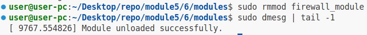

# Задание №6

### 1.Установим необходимые заголовки (используем apt package manager)

```
sudo apt-get install build-essential linux-headers-$(uname -r)
```

### 2.Соберём модуль ядра:

```
make build_mod

# Вывод

make -C /lib/modules/6.14.0-28-generic/build M=/home/user/Desktop/repo/module5/4/modules modules
make[1]: вход в каталог «/usr/src/linux-headers-6.14.0-28-generic»
make[2]: вход в каталог «/home/user/Desktop/repo/module5/6/modules»
warning: the compiler differs from the one used to build the kernel
  The kernel was built by: x86_64-linux-gnu-gcc-13 (Ubuntu 13.3.0-6ubuntu2~24.04) 13.3.0
  You are using:           gcc-13 (Ubuntu 13.3.0-6ubuntu2~24.04) 13.3.0
  CC [M]  chardev_module.o
  MODPOST Module.symvers
  CC [M]  chardev_module.mod.o
  CC [M]  .module-common.o
  LD [M]  chardev_module.ko
  BTF [M] chardev_module.ko
Skipping BTF generation for chardev_module.ko due to unavailability of vmlinux
make[2]: выход из каталога «/home/user/Desktop/repo/module5/6/modules»
make[1]: выход из каталога «/usr/src/linux-headers-6.14.0-28-generic»

```

### 3.Добавим модуль в ядро "Наживую"

```
make insert_mod
```

Проверим загрузку модуля:

```
sudo dmesg | tail -1

# Вывод

[ 8652.970311] Module loaded successfully.

```

### 4.Проверим наличие файла в /proc

```
ls /proc/ | grep blacklist_ip

# Вывод

blacklist_ip

```

#### Скриншот


### 5.Настроим блокировку пакетов с ip-адреса сайта НГТУ(217.71.131.242)

```

echo 'add 217.71.131.242' > /proc/blacklist_ip
cat /proc/blacklist_ip
sudo dmesg | tail -1

# Вывод

217.71.131.242
[ 9186.841874] Adding 00000000943f21a7(217.71.131.242) to blacklist.

```

#### Скриншот


### 6.Проверим работу блокировки используя ping

```
ping nstu.ru

sudo dmesg | tail -1

# Вывод

PING nstu.ru (217.71.131.242) 56(84) bytes of data.
^C
--- nstu.ru ping statistics ---
3 packets transmitted, 0 received, 100% packet loss, time 2029ms

[ 9267.131271] Dropped packet destined to 217.71.131.242.

```

#### Скриншот


### 7. Уберём ip-адрес сайта НГТУ(217.71.131.242) из списка заблокированных и проверим ping-ом

```
echo 'del 217.71.131.242' > /proc/blacklist_ip
cat /proc/blacklist_ip
sudo dmesg | tail -1
ping nstu.ru -c 1

# Вывод

[ 9517.323102] Removing 00000000943f21a7(217.71.131.242) from blacklist.

PING nstu.ru (217.71.131.242) 56(84) bytes of data.
64 bytes from ciu.nstu.ru (217.71.131.242): icmp_seq=1 ttl=53 time=5.01 ms

--- nstu.ru ping statistics ---
1 packets transmitted, 1 received, 0% packet loss, time 0ms
rtt min/avg/max/mdev = 5.011/5.011/5.011/0.000 ms

```

#### Скриншот


### 8.Выгрузим модуль из ядра

```
sudo rmmod firewall_module
```

Проверим выгрузку модуля:

```
sudo dmesg | tail -1

# Вывод

[ 9767.554826] Module unloaded successfully.

```

#### Скриншот



### 7.Выполним цель билда clean в make

```
make clean

# Вывод

make -C /lib/modules/6.14.0-28-generic/build M=/home/user/Desktop/repo/module5/6/modules clean
make[1]: вход в каталог «/usr/src/linux-headers-6.14.0-28-generic»
make[2]: вход в каталог «/home/user/Desktop/repo/module5/6/modules»
  CLEAN   Module.symvers
make[2]: выход из каталога «/home/user/Desktop/repo/module5/6/modules»
make[1]: выход из каталога «/usr/src/linux-headers-6.14.0-28-generic»

```

### Скриншот


